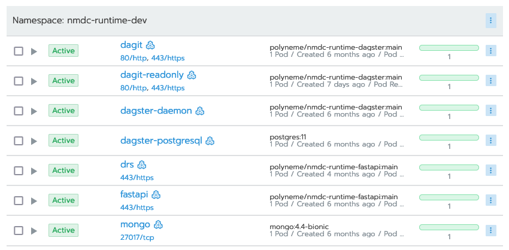

# Administration

## Uptime / System Status

The up/down status of NMDC Runtime components is available at <https://nmdcstatus.polyneme.xyz/>,
which currently shows the <https://updown.io/p/nia64> status page.

A GET request is done for each registered HTTP resource every hour, with a satisfactory response
time set as 2 seconds. There are three active monitoring locations in North America, and there are
four active notification recipients - `dehays`, `dwinston`, and `scanon` via email; and the
`#updown` channel in the [NMDC Slack organization](https://nmdc-group.slack.com).

The component containers are hosted on the [NERSC Spin](https://www.nersc.gov/systems/spin/) system,
so [NERSC's Live Status page](https://www.nersc.gov/live-status/motd/) is a place to check if
anything is down. Furthermore, note the Planned Outages section of that page, particularly any
notices for Spin.

If NERSC Spin is up, and some service appears to be down, check out Spin's Rancher 2 web interface
at <https://rancher2.spin.nersc.gov/>. The NMDC Runtime system is currently deployed on the
`development` cluster as part of the NMDC's `m3408` project, under the `nmdc-runtime-dev namespace`.
There, you can examine the workloads in the namespace and troubleshoot as appropriate -- redeploy,
execute a shell in a container to diagnose, view logs, etc. Here is an example screenshot of active
workloads:



## Create API Users

Users that are admins of the `nmdc-runtime-useradmin` site may create API users. Currently, these
users are `scanon`, `dehays`, and `dwinston`.

You can see what sites you administer via `GET /users/me` when logged in.

!!! example "example `GET /users/me` result"
    ```json
    {
      "username": "dwinston",
      "site_admin": [
        "dwinston-laptop",
        "nmdc-runtime-useradmin"
      ]
    }
    ```

Log in via your username and password, and `POST /users` to create a new user. The only required
fields are `username` and `password`.

## Modifying API permissions

For fine-grained control over which users have access to particular API endpoints, you may currently
do so at the code level. A suitable template for this is the [implementation of the POST
/users](https://github.com/microbiomedata/nmdc-runtime/blob/1d0feb68fb5ed82ed82c06f9724ecc86f73d83ae/nmdc_runtime/api/endpoints/users.py#L78)
endpoint. The endpoint code receives the requesting user model via the `get_current_active_user`
dependency, and it uses the `check_can_create_user` function to verify that the requester can
administer the "nmdc-runtime-useradmin" site. If not, a `403 Forbidden` expection is raised.
Otherwise, the endpoint logic continues for the authorized user.

To add a site ID to an existing user's `site_admin` list, this must currently be done manually at
the MongoDB document level, rather than via an admin-accessible API endpoint.


## MongoDB Administration

The MongoDB instance backing the runtime is deployed on NERSC Spin.

The root admin password is stored as the `mongo-root-password` secret in the `nmdc-runtime-dev`
namespace on the Spin k8s development cluster
([link](https://rancher2.spin.nersc.gov/p/c-fwj56:p-nlxq2/secrets/nmdc-runtime-dev:mongo-root-password)).

`scanon` and `dehays` have `dbOwner` roles on the `nmdc` database.

!!! tip
    There is a `nersc-ssh-tunnel` target in the repository's
    [`Makefile`](https://github.com/microbiomedata/nmdc-runtime/blob/main/Makefile)
    that can help you map the remote mongo database to a port on your local machine.

## Deployment

The [release process](howto-guides/release-process.md) is administered by the [NMDC architecture working group
GitHub team](https://github.com/orgs/microbiomedata/teams/architecture-wg). Members of this team
have full access to repository administration, including the GitHub Actions.

As for the deployed infrastructure, when manual intervention may be necessary, first check the
Rancher 2 web interface to the NERSC Spin service's Kubernetes clusters, i.e.
<https://rancher2.spin.nersc.gov/>. The Runtime system is currently deployed on the development
cluster as part of the NMDC's `m3408` project, under the `nmdc-runtime-dev` namespace.

The go-to people to troubleshoot deployment issues within NERSC Spin at this time are `shreyas`,
`dwinston`, `eecavanna`, and `scanon`.

## Databases

Data is stored in the `nmdc` database.

If you need to delete objects copy it to `nmdc_deleted` database under the corresponding collection

## nmdc-schema update

1. Set the desired version of `nmdc-schema` in `requirements/main.in`.
2. `make update-deps`.
3. commit and push, start PR and seek approval + merge to `main`, which will trigger GH actions to deploy.
