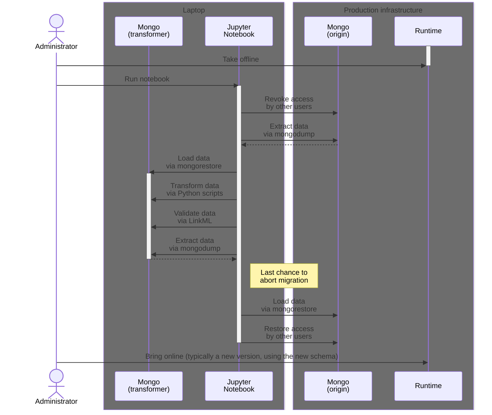

# Database migration

## Introduction

In this document, I'll [explain](https://diataxis.fr/explanation/) how we migrate the NMDC database from conforming to _one_ version of the [NMDC Schema](https://microbiomedata.github.io/nmdc-schema/), to conforming to _another_ version of the NMDC Schema.

## Overview

We currently use an [Extract, Transform, Load](https://en.wikipedia.org/wiki/Extract,_transform,_load) (ETL) process to migrate the database.

> **FAQ: Why not "Transform in place?"**
>
> _...like Alembic (Python), Active Record (Ruby), Sequelize (JS), etc. do?_
>
> At the time we began designing a migration process, some NMDC team members did not feel comfortable with us using a "Transform in place" process. A contributing factor to that may have been the fact that—at that time—the MongoDB instances used in the Runtime's local development and CI (GHA) test environments [did not support](https://github.com/microbiomedata/nmdc-runtime/issues/925) the use of transactions.
>
> The decision not to use a "Transform in place" process is one we expect to revisit, now that (a) team members' confidence in the migration process has increased, and (b) the MongoDB instances used in the aforementioned environments [now support](https://github.com/microbiomedata/nmdc-runtime/pull/884) the use of transactions.

We use Jupyter notebooks to **perform** the "Extract" and "Load" steps, and to **orchestrate** the "Transform" step. We use Python scripts to **perform** the "Transform" step.

The Jupyter notebooks reside in the `db/` directory of the [`nmdc-runtime`](https://github.com/microbiomedata/nmdc-runtime/) repository. In general, we try to keep all code that interacts directly with the NMDC database, in that repository.

> **FAQ: Why use a Jupyter notebook?**
>
> _...as opposed to a Python script/module?_
>
> At the time we began designing a migration process, we wanted to micromanage the process (i.e. scrutinize each command—whether shell or Python—and its output in the moment) the first few times we executed it. We thought doing that would be easier for us by using a Jupyter notebook compared to using a CLI script.
>
> Now that (a) the notebook has remained roughly the same for each recent migration, and (b) we can use transactions in the Runtime's local development and CI (GHA) test environments; we think moving to a Python script/module is within reach. Ultimately, we want to [eliminate human intervention](https://github.com/microbiomedata/nmdc-runtime/issues/919) from (i.e. automate) the migration process.

The Python scripts [that we use to **perform** the "Transform" step] reside in the `nmdc_schema/migrators/` directory of the [`nmdc-schema`](https://github.com/microbiomedata/nmdc-schema/) repository. These are typically written by data modelers.

## Process

The migration process looks like this:

    
Show/hide glossary

- **Mongo**: A nickname for [MongoDB](https://www.mongodb.com/).
- **Mongo (origin)**: The database we are migrating.
- **Mongo (transformer)**: The database we are using to transform data.

Each Jupyter notebook walks the administrator through the above steps, except for the "Take offline" and "Bring online" steps at the beginning and end of the process.

> Those two exceptional steps—which are specific to our hosting environment—are covered in the [Runtime release management documentation](https://github.com/microbiomedata/infra-admin/blob/main/releases/nmdc-runtime.md#making-a-release), located in our internal infrastructure administration documentation repository (named `infra-admin`).

## Appendix

### Precursors to this document

- The "Data Releases" section of [`docs/howto-guides/release-process.md`](./release-process.md)
