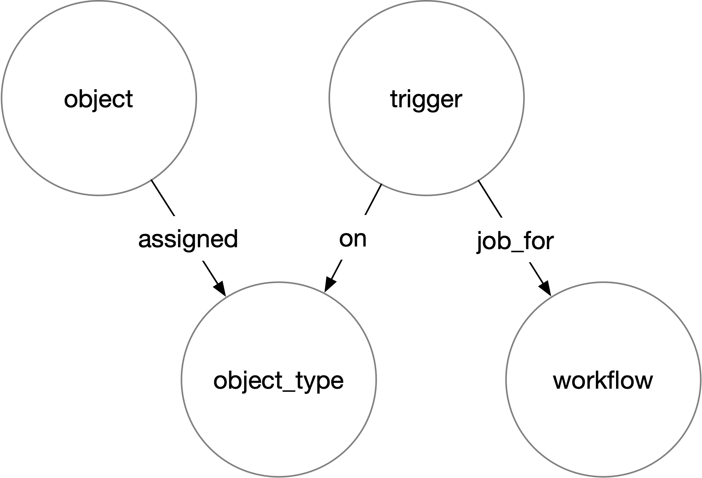

# Create Workflow Triggers To Spawn Jobs

Jobs represent work to be done. Specifically, a [Job](https://api.microbiomedata.org/docs#/jobs)
is a request to run a [Workflow](https://api.microbiomedata.org/docs#/workflows) given a certain
[Object](https://api.microbiomedata.org/docs#/objects) as its input. The Runtime system will
spawn a new Job when:

1. An [Object](https://api.microbiomedata.org/docs#/objects),
2. is assigned an [Object Type](https://api.microbiomedata.org/docs#/object_types),
3. which is associated with a [Workflow](https://api.microbiomedata.org/docs#/workflows),
4. through a [Trigger](https://api.microbiomedata.org/docs#/triggers).

<figure markdown style="max-width: 25em">
  
  <figcaption>Job Triggering</figcaption>
</figure>

Thus, to empower the Runtime to recognize and spawn new jobs to be done, a new Trigger must be
registered with the system. Add a trigger to the codebase in
[`nmdc_runtime.api.boot.triggers`](https://github.com/microbiomedata/nmdc-runtime/blob/main/nmdc_runtime/api/boot/triggers.py).
You will need an Object Type ID and a Workflow ID

Workflows are also registered with the system via a code module,
[`nmdc_runtime.api.boot.workflows`](https://github.com/microbiomedata/nmdc-runtime/blob/main/nmdc_runtime/api/boot/workflows.py).
Find your target workflow ID there, or add it there if need be.

Finally, Object Types are registered in a similar manner, via
[`nmdc_runtime.api.boot.object_types`](https://github.com/microbiomedata/nmdc-runtime/blob/main/nmdc_runtime/api/boot/object_types.py).
Find your target object type ID there, or add it there if need be.

Once a valid trigger is registered with the system, the `process_workflow_job_triggers`
[Sensor](https://docs.dagster.io/concepts/partitions-schedules-sensors/sensors) in
[`nmdc_runtime.site.repository`](https://github.com/microbiomedata/nmdc-runtime/blob/main/nmdc_runtime/site/repository.py)
can sense when there are object IDs tagged with object types corresponding to a registered trigger.
If a job hasn't yet been created for the object-type-triggered workflow with the given object as
input, the Runtime will create this job so that a site can claim and run the job.