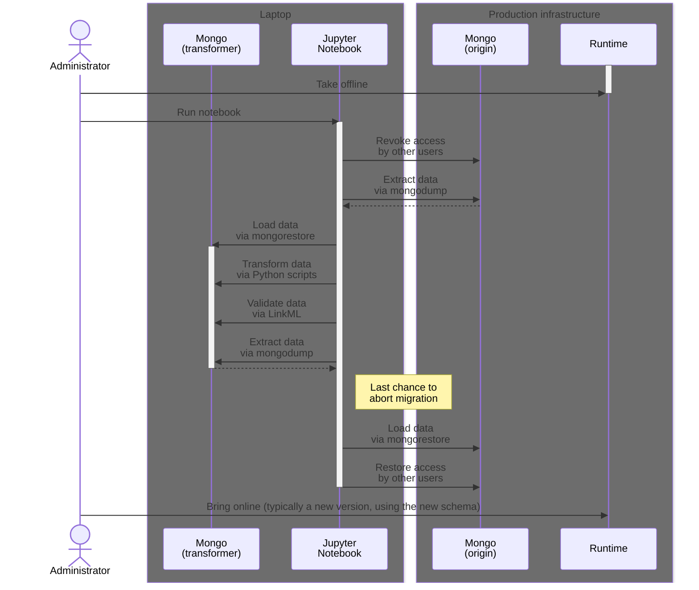

# How to migrate the database

## Introduction

In this [how-to guide](https://diataxis.fr/how-to-guides/), I'll tell you how you can migrate the Mongo database from conforming to _one_ version of the NMDC Schema, to conforming to _another_ version of the NMDC Schema.

## Glossary

- **Mongo**: A nickname for MongoDB.
- **Old schema**: The version of the NMDC Schema you will be migrating the database **from**.
- **New schema**: The version of the NMDC Schema you will be migrating the database **to**.
- **Origin database**: The database you want to migrate.
- **Transformer database**: The database you will use to transform data.

## Overview

We currently use an [Extract, Transform, Load](https://en.wikipedia.org/wiki/Extract,_transform,_load) (ETL) process to migrate the database.

> **FAQ: Why not "Transform in place?"**
>
> _...like Alembic (Python), Active Record (Ruby), Sequelize (JS), etc. do?_
>
> At the time we began designing a migration process, some NMDC team members did not feel comfortable with us using a "Transform in place" process. A contributing factor to that may have been the fact that—at that time—the MongoDB instances used in the Runtime's local development and CI (GHA) test environments [did not support](https://github.com/microbiomedata/nmdc-runtime/issues/925) the use of transactions.
>
> The decision not to use a "Transform in place" process is one we expect to revisit, now that (a) team members' confidence in the migration process has increased, and (b) the MongoDB instances used in the aforementioned environments [now support](https://github.com/microbiomedata/nmdc-runtime/pull/884) the use of transactions.

We use Jupyter notebooks to **perform** the "Extract" and "Load" steps, and to **orchestrate** the "Transform" step. We use Python scripts to **perform** the "Transform" step.

The Jupyter notebooks reside in the `db/` directory of the [`nmdc-runtime`](https://github.com/microbiomedata/nmdc-runtime/) repository. In general, we try to keep all code that interacts directly with the NMDC database, in that repository.

The Python scripts reside in the `nmdc_schema/migrators/` directory of the [`nmdc-schema`](https://github.com/microbiomedata/nmdc-schema/) repository. These are typically written by data modelers.

The basic flow of a migration looks like this:

## Prerequisites

<!-- FIXME: This is at least partially obsolete. -->

1. You're running the latest version of [nmdc-runtime](https://github.com/microbiomedata/nmdc-runtime) on your computer—by that, I mean:
    - Its [Docker-based development environment](https://github.com/microbiomedata/nmdc-runtime/blob/main/docker-compose.yml) is running on your computer (at least, the `fastapi` and `mongo` containers).
    - The `main` branch in your clone matches the `main` branch on GitHub (run `$ git diff main origin/main` to check).
    - The `main` branch is checked out and there are no uncommitted changes (run `$ git status` to check).
    - The `nmdc-schema` Python package used by this version of `nmdc-runtime` contains the **old schema**.
1. An `nmdc-schema` Python package containing the **new schema** is available on [PyPI](https://pypi.org/project/nmdc-schema/).
    - The package version number is stored in [(nmdc-schema) `pyproject.toml`](https://github.com/microbiomedata/nmdc-schema/blob/main/pyproject.toml#L13)
    - The schema version number is stored in [(nmdc-schema) `src/schema/nmdc.yaml`](https://github.com/microbiomedata/nmdc-schema/blob/main/src/schema/nmdc.yaml#L22)
1. Root credentials for the **origin database**.
1. Root credentials for the **transformer database**.

## Procedure

<!-- TODO: Write this. Consider moving the above Mermaid chart to here. -->

1. 

## Appendix

### Precursors to this how-to guide

- The "Data Releases" section of [`docs/howto-guides/release-process.md`](./release-process.md)
