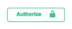
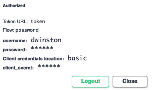

# Logging into the Runtime API

## Log in as a user

Open [api.microbiomedata.org/docs](https://api.microbiomedata.org/docs) and click on
the "Authorize" button located above the list of endpoints:



In the modal dialog that appears, locate the section entitled "User login"
and—in that section—enter your username and password, then click
the "Authorize" button located below those fields.

When you are logged in, the "username" field will turn into read-only text
and the "password" field will turn into asterisks, as shown here:



Once you're logged in, click the "Close" button to close the modal and return
focus to the API documentation.

## Create a user

> **Important:** Only Runtime administrators (i.e. Runtime users that are admins of the special site
named "`nmdc-runtime-useradmin`") can create users.

Go to [`POST /users`](https://api.microbiomedata.org/docs#/User%20accounts/Create_User_users_post), and
click the `Try it out` button. In the request body, the only required fields are `username` and
`password`. If you know the `id`s of any sites you would like the new user to administer, enter
those as an array value for the `site_admin` field.

Share the new user's password securely with them. For example, a free instance of the open-source
[snappass](https://github.com/pinterest/snappass) web app is hosted by Polyneme at
[snappass.polyneme.xyz](https://snappass.polyneme.xyz). This will generate a one-time link that you can email, send via
Slack message, etc. to the new user.

## Create a site client

If you administer one or more sites, you can generate credentials for a site client that will act on
behalf of the site. This is used for managing certain API resources—rather than
an _individual person_ being responsible for a resource, a _site_ is responsible for it,
allowing for users that _administer_ that site to "come and go" over time.

Once logged in, you can use [`GET /users/me`](https://api.microbiomedata.org/docs#/User%20accounts/Get_User_Information_users_me_get) to see
the `id`s of sites you can administer. Example response:

```json
{
  "username": "alice_the_admin",
  "site_admin": [
    "alice-laptop",
    "nmdc-runtime-useradmin"
  ]
}
```

```json
{
  "username": "bob_the_bioinformatician",
  "site_admin": [
    "bob-laptop"
  ]
}
```

You can create a site via [`POST /sites`](https://api.microbiomedata.org/docs#/Workflow%20management/create_site_sites_post).
If the `id` you request is already in use (i.e. already exists), you will get an error response.
We suggest ignoring `capability_ids` for now; that can be populated later.

Once you have identified the site you want to generate credentials for, you can use use
the [`POST /sites/{site_id}:generateCredentials`](https://api.microbiomedata.org/docs#/Workflow%20management/generate_credentials_for_site_client_sites__site_id__generateCredentials_post)
endpoint to do so. The response will contain the credentials for the generated site client,
which will look something like this:

```json
{
  "client_id": "sys0***",
  "client_secret": "***"
}
```

Store these two values securely for future use. Treat the `client_secret` value, specifically,
like you would treat a password.

## Log in as a site client

Now that you have site client credentials, you can log in as the associated site.

Open [api.microbiomedata.org/docs](https://api.microbiomedata.org/docs) and click on
the "Authorize" button located above the list of endpoints:


In the modal dialog that appears, if any sections show that you are already logged in,
click the "Logout" button in each of those sections before continuing.

Next, locate the section entitled "Site client login"
and—in that section—enter your `client_id` and `client_secret` values, then click
the "Authorize" button located below those fields.

You are now logged in as a site client.
