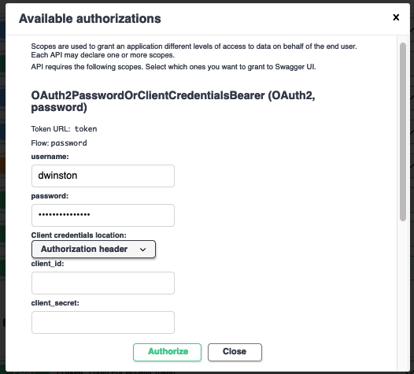
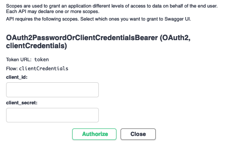

# User/Site Login and Authentication

## Log in as a User

Open <https://api.microbiomedata.org/docs> and click on the `Authorize` button near the top of
the page:


In the modal dialog, enter your given `username` and `password` in the first form, and click
`Authorize`:



Once authorized, hit `Close` to get back to the interactive API documentation:


## Create a User

!!! info 
    You need to be already logged in to create a new user.
    Also, only users `aclum`, `dwinston`, `scanon`, and `scholia` can create new users at this time.

Go to [POST /users](https://api.microbiomedata.org/docs#/users/create_user_users_post), and
click the `Try it out` button. In the request body, the only required fields are `username` and
`password`. If you know the `id`s of any sites you would like the new user to administer, enter
those as an array value for the `site_admin` field.

Share a new user's password securely with them. For example, a free instance of the open-source
[snappass](https://github.com/pinterest/snappass) web app is hosted by `dwinston` at
<https://snappass.polyneme.xyz/>. This will generate a one-time link that you can email, send via
Slack message, etc. to the new user.

## Create a Site Client

If you administer one or more sites, you can generate credentials for a site client that will act on
behalf of the site. This is used for managing certain API resources -- rather than a person being
responsible for a resource, a site is, and users that administer the site can come and go.

Once logged in, you can use [GET
/users/me](https://api.microbiomedata.org/docs#/users/read_users_me_users_me__get) to see the
`id`s of sites you can administer. Example response:

```json
{
  "username": "dwinston",
  "site_admin": [
    "dwinston-laptop",
    "nmdc-runtime-useradmin",
    "dwinston-cloud"
  ]
}
```

You can create your own sites via [POST
/sites](https://api.microbiomedata.org/docs#/sites/create_site_sites_post). If the `id` you
request already exists, you will get an error response. Do not worry about setting `capability_ids`;
those can be set later.

Once you have identified a site for which to generate credentials, use [POST
/sites/{site_id}:generateCredentials](https://api.microbiomedata.org/docs#/sites/generate_credentials_for_site_client_sites__site_id__generateCredentials_post)
to do so. The response will look something like

```json
{
  "client_id": "sys0***",
  "client_secret": "***"
}
```

Save this information like you saved your username and password.

## Log in as a Site

Click on the `Authorize` button near the top of <https://api.microbiomedata.org/docs>. You may
need to `Logout` first. Scroll all the way down to the second form, the one with only two fields,
`client_id` and `client_secret`:



Note that the form is for the `clientCredentials` flow, whereas the first form is for the `password`
flow. In this clientCredentials form, enter your site client credentials and `Authorize`. You are
now logged in as a site client.

