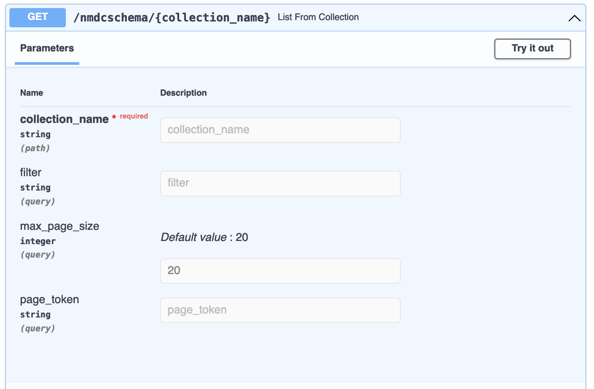
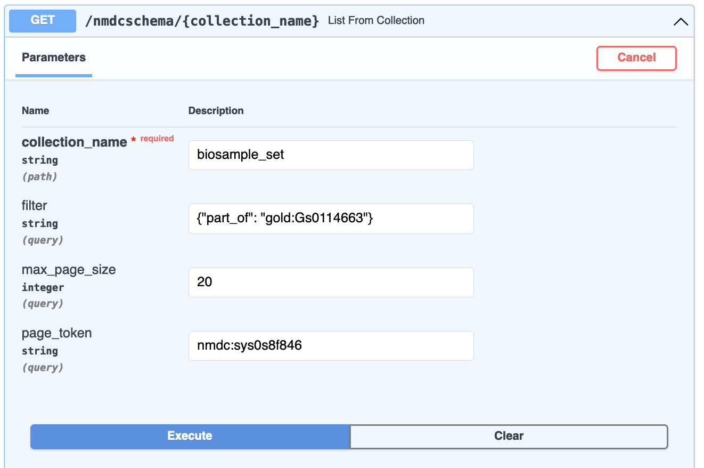

# Validate JSON and Fetch JSON

Let's dive in and get acquainted with the NMDC Runtime API.

## Validate JSON

Already? Yes. Let's do this. Here is a tiny
[nmdc:Database](https://microbiomedata.github.io/nmdc-schema/Database/) JSON object:

```json
{"biosample_set": [{"id": 42}]}
```

This represents a set of [nmdc:Biosample](https://microbiomedata.github.io/nmdc-schema/Biosample/)
objects. There is just one, with an `id` of `42`.

Let's validate it. Go to the [POST
/metadata/json:validate](https://api.microbiomedata.org/docs#/metadata/validate_json_metadata_json_validate_post)
endpoint at <https://api.microbiomedata.org/docs> and click "Try it out":


Now, copy the above JSON object, paste it into the `Request body` field, and hit `Execute`:


This gives us a response where the result is "errors". Looks like a biosample `id` needs to be a
string value, and we are missing required properties. We also get a display of a `curl` command
to reproduce the request on the command line:


Let's see what a "valid" response looks like. The [GET
/nmdcschema/{collection_name}/{doc_id}](https://api.microbiomedata.org/docs#/metadata/get_from_collection_by_id_nmdcschema__collection_name___doc_id__get)
endpoint allows us to get the NMDC-schema-validated JSON object for one of the NMDC metadata
collections:


For example,
[https://api.microbiomedata.org/nmdcschema/biosample_set/nmdc:bsm-11-002vgm56](https://api.microbiomedata.org/nmdcschema/biosample_set/nmdc:bsm-11-002vgm56)
is

```json
{
  "analysis_type": [
    "metagenomics"
  ],
  "carb_nitro_ratio": {
    "has_numeric_value": 25.4,
    "type": "nmdc:QuantityValue"
  },
  "collection_date": {
    "has_raw_value": "2016-07-26T01:30Z",
    "type": "nmdc:TimestampValue"
  },
  "depth": {
    "has_maximum_numeric_value": 0.325,
    "has_minimum_numeric_value": 0,
    "has_unit": "m",
    "type": "nmdc:QuantityValue"
  },
  "elev": 677.6,
  "env_broad_scale": {
    "term": {
      "id": "ENVO:00000446",
      "name": "terrestrial biome",
      "type": "nmdc:OntologyClass"
    },
    "type": "nmdc:ControlledIdentifiedTermValue"
  },
  "env_local_scale": {
    "term": {
      "id": "ENVO:01000861",
      "name": "area of dwarf scrub",
      "type": "nmdc:OntologyClass"
    },
    "type": "nmdc:ControlledIdentifiedTermValue"
  },
  "env_medium": {
    "term": {
      "id": "ENVO:00001998",
      "name": "soil",
      "type": "nmdc:OntologyClass"
    },
    "type": "nmdc:ControlledIdentifiedTermValue"
  },
  "env_package": {
    "has_raw_value": "soil",
    "type": "nmdc:TextValue"
  },
  "id": "nmdc:bsm-11-002vgm56",
  "name": "HEAL_048-O-6.5-19.5-20160725",
  "nitro": {
    "has_numeric_value": 1.02,
    "has_unit": "percent",
    "type": "nmdc:QuantityValue"
  },
  "org_carb": {
    "has_numeric_value": 25.94,
    "has_unit": "percent",
    "type": "nmdc:QuantityValue"
  },
  "ph": 6.04,
  "samp_collec_device": "corer",
  "soil_horizon": "O horizon",
  "temp": {
    "has_numeric_value": 6.6,
    "has_unit": "Celsius",
    "type": "nmdc:QuantityValue"
  },
  "type": "nmdc:Biosample",
  "water_content": [
    "2.667 g of water/g of dry soil"
  ],
  "geo_loc_name": {
    "has_raw_value": "USA: Alaska, Healy",
    "type": "nmdc:TextValue"
  },
  "biosample_categories": [
    "NEON"
  ],
  "lat_lon": {
    "latitude": 63.875088,
    "longitude": -149.210438,
    "type": "nmdc:GeolocationValue"
  },
  "gold_biosample_identifiers": [
    "gold:Gb0255739"
  ],
  "ecosystem": "Environmental",
  "ecosystem_category": "Terrestrial",
  "ecosystem_type": "Soil",
  "ecosystem_subtype": "Unclassified",
  "associated_studies": [
    "nmdc:sty-11-34xj1150"
  ]
}
```

Now, copying and paste the above into the request body for `POST /metadata/json:validate`. Remember,
the body needs to be a nmdc:Database object, in this case with a single member of the biosample_set
collection, so copy and paste the `{"biosample_set": [` and `]}` parts to book-end the document
JSON:

```json
{"biosample_set": [
"PASTE_JSON_DOCUMENT_HERE"
]}
```

Now, when you execute the request, the response body will be

```json
{
  "result": "All Okay!"
}
```

Hooray!

## Get a List of NMDC-Schema-Compliant Documents

The [GET
/nmdcschema/{collection_name}](https://api.microbiomedata.org/docs#/metadata/list_from_collection_nmdcschema__collection_name__get)
endpoint allows you to get a filtered list of documents from one of the NMDC Schema collections:



The `collection_name` must be one defined for a
[nmdc:Database](https://microbiomedata.github.io/nmdc-schema/Database/), in the form expected by the
JSON Schema,
[nmdc.schema.json](https://github.com/microbiomedata/nmdc-schema/blob/69fd1ee91afac1a943b2cc9bfbfdecd0e2cdd089/jsonschema/nmdc.schema.json#L987).
This typically means that any spaces in the name should be entered as underscores (`_`) instead.

The `filter`, if provided, is a JSON document in the form of the
[MongoDB Query Language](https://docs.mongodb.com/manual/tutorial/query-documents/). For example,
the filter `{"associated_studies": "nmdc:sty-11-34xj1150"}` on collection_name `biosample_set` will list biosamples
that are associated with the `nmdc:sty-11-34xj1150` study:


When I execute that query, I use the default `max_page_size` of 20, meaning at most 20 documents are
returned at a time. A much larger `max_page_size` is fine for programs/scripts, but can make your
web browser less responsive when using the interactive documentation.

The response body for [our
request](https://api.microbiomedata.org/nmdcschema/biosample_set?filter=%7B%22part_of%22%3A%20%22gold%3AGs0114663%22%7D&max_page_size=20)
has two fields, `resources` and `next_page_token`:

```json
{
  "resources": [
    ...
  ],
  "next_page_token": "nmdc:sys0s8f846"
}

```

`resources` is a list of documents. `next_page_token` is a value you can plug into a subsequent
request as the `page_token` parameter:



This will return the next page of results. You do need to keep the other request parameters the
same. In this way, you can page through and retrieve all documents that match a given filter (or no
filter) for a given collection. Page tokens are ephemeral: once you use one in a request, it is
removed from the system's memory.