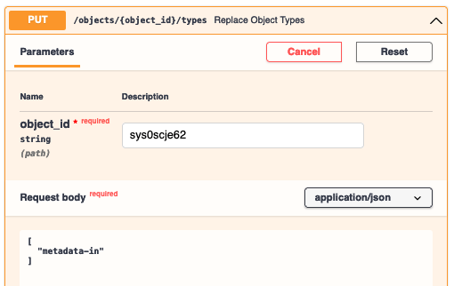

# Submit Metadata as JSON

## Create a Data Repository Service (DRS) Object

I have created a public gist on Github via <https://gist.github.com/> (a free service) for a fake
biosample:

```json
{"biosample_set": [{
    "id": "fake",
    "env_broad_scale" : {
        "term" : {"id": "ENVO:01000253"}
    }, 
    "env_local_scale" : {
        "term" : {"id": "ENVO:01000621"}
    }, 
    }, 
    "env_medium" : {
        "term" : {"id": "ENVO:01000017"}
    }}
]}
```

We will use this example for the tutorial. The link to the gist is
<https://gist.github.com/dwinston/591afa6de4216d8fc4164c39f6418866>, and if you click on the `Raw`
button at the top-right corner of the code display window, you will get [a
URL](https://gist.githubusercontent.com/dwinston/591afa6de4216d8fc4164c39f6418866/raw/4cc38cdf7b5edd9bb6a08897733346b62730002c/fake_biosample.json)
for the raw data.

To create an object in the API, we need at least a URL, file checksum, file size, and the time the
file was created / last modified prior to registration with the API. It's also recommended that you
include a file name (with file extension ".json" in this case) and description.

```
# Example of obtaining sha256 checksum and file size in bytes on the command line: 
$ wget https://gist.githubusercontent.com/dwinston/591afa6de4216d8fc4164c39f6418866/raw/4cc38cdf7b5edd9bb6a08897733346b62730002c/fake_biosample.json
...‘fake_biosample.json’ saved...
$ openssl dgst -sha256 fake_biosample.json
SHA256(fake_biosample.json)= c65ae13038ac980662472487a5a36cae23097e9c164fcbf0877b52b957d7faa7
$ stat -f "%z bytes" fake_biosample.json
260 bytes
```

```json
{
  "description": "A fake biosample.",
  "name": "fake_biosample.json",
  "access_methods": [
    {
      "access_url": {
        "url": "https://gist.githubusercontent.com/dwinston/591afa6de4216d8fc4164c39f6418866/raw/4cc38cdf7b5edd9bb6a08897733346b62730002c/fake_biosample.json"
      }
    }
  ],
  "checksums": [
    {
      "checksum": "c65ae13038ac980662472487a5a36cae23097e9c164fcbf0877b52b957d7faa7",
      "type": "sha256"
    }
  ],
  "size": 260,
  "created_time": "2021-11-17T10:30:00-05:00"
}
```

After a [POST /objects](https://api.microbiomedata.org/docs#/objects/create_object_objects_post)
with the above as the request body, I get back a response object with an `id` that looks like
`sys0***`.

## Annotate the DRS object with the "metadata-in" type

Now, go to [PUT
/objects/{object_id}/types](https://api.microbiomedata.org/docs#/objects/replace_object_types_objects__object_id__types_put)
and ensure the types array for the object is `["metadata-in"]`. This lets the Runtime know that you
intend for this object to be ingested as NMDC metadata.



## Monitor the progress of metadata ingest

After tagging the DRS Object as "metadata-in", the NMDC Runtime site
[senses](https://dagit-readonly.nmdc-runtime-dev.polyneme.xyz/workspace/repo@nmdc_runtime.site.repository:repo/sensors/process_workflow_job_triggers)
that a new "metadata-in-1.0.0" job should be run given your DRS object `id` as input. You can then
[monitor
runs](https://dagit-readonly.nmdc-runtime-dev.polyneme.xyz/workspace/repo@nmdc_runtime.site.repository:repo/jobs/apply_metadata_in/runs)
of the job.

In general, <https://dagit-readonly.nmdc-runtime-dev.polyneme.xyz/instance/runs> will give you an
overview of the NMDC Runtime site's job runs. If you have the username and password (ask `dehays`),
you can administer the underlying Dagster orchestrator via its Dagit web UI via
<https://dagit.dev.microbiomedata.org/>.

!!! note
    The read-only version is hosted at NERSC in the same
    kubernetes pod as the read-write version -- we just haven't gotten around to getting a SSL
    certificate for a `*.mirobiomedata.org` subdomain.

Here's an example of the general Runs view after our new metadata has been ingested:


And indeed it has been ingested! See
<https://api.microbiomedata.org/nmdcschema/biosample_set/fake> (unless we already deleted it --
see section below).

## Removing a JSON document

!!! info
    You must be authorized to do this. Specifically, a document of the form 
    ```json
    {
        "username" : <YOUR_USERNAME>,
        "action" : "/queries:run(query_cmd:DeleteCommand)",
    }
    ```
    must be present in the `_runtime.api.allow` database collection.
    Ask a [database administrator](../admin.md) to be added.
    Any to-be-deleted documents are backed up to a separate database immediately prior to deletion.

A call to [POST
/queries:run](https://api.microbiomedata.org/docs#/queries/run_query_queries_run_post) with the
body

```json
{
  "delete": "biosample_set",
  "deletes": [{"q": {"id": "fake"}, "limit": 1}]
}
```

will remove our fake document. Note that you need to be logged in as a *user*, NOT as a *site
client*, to execute such a request. The syntax for the request is a subset of the [MongoDB `delete`
command](https://docs.mongodb.com/v4.4/reference/command/delete/) syntax.

!!! danger
    People who can delete documents can currently delete a document from *any* collection. 
    ```
    {
      "delete": "users",
      "deletes": [{"q": {"username": "useridontlike"}, "limit": 1}]
    }
    ```
