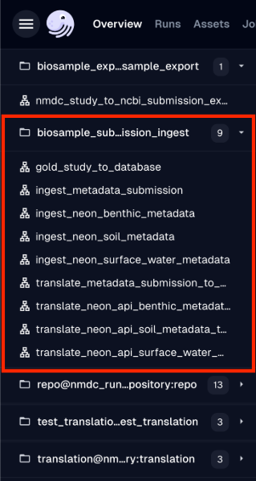

# Metadata Ingest Pipelines (Translators)

## Introduction

Metadata ingest pipelines (often referred to as *translators*) are pipelines that are run when we want to bring in (ingest) metadata (biosample, lab processing metadata, etc.) into the NMDC database. Ingest sources that are currently supported, i.e., sources that we currently have pipelines for are:

* [NMDC Submission Portal](https://data.microbiomedata.org/submission/home)
* [JGI GOLD](https://gold.jgi.doe.gov/)
* [NSF NEON](https://www.neonscience.org/)
    * Soil Data Product ([DP1.10086.001](https://data.neonscience.org/data-products/DP1.10086.001) and [DP1.10107.001](https://data.neonscience.org/data-products/DP1.10107.001))
    * Benthic Water Data Product ([DP1.20279.001](https://data.neonscience.org/data-products/DP1.20279.001))
    * Surface Water Data Product ([DP1.20281.001](https://data.neonscience.org/data-products/DP1.20281.001))

## Procedure

The steps below describe how to run the metadata ingest pipelines (*translators*).

1. Go to either the development or production Dagit interface: https://dagit-dev.microbiomedata.org/ or https://dagit.microbiomedata.org/. If you're running Dagster locally through Docker containers, then go to http://localhost:3000/.
2. Find the hamburger button (`☰`) to the left, and a side panel should open up.
3. You will see a section in that panel called `biosample_submission_ingest@nmdc_runtime.site.repository:biosample_submission_ingest` under which you will see all the translator pipelines that you can run.
4. 
5. Select any of the above pipelines, and click on the ***Launchpad*** tab/section.
6. You will see different configuration parameters that you need to fill out for different pipelines.
7. Once you're done filling out the configuration parameters, you can hit the ***Launch Run*** button at the bottom right of the screen, and monitor the progress of your run.
8. You can also track the history of all your past runs in the ***Runs*** tab/section.
9. For some of the translators you will notice that they are in pairs (prefixed with *translate_* and *ingest_*). The reason is that the *translate_* prefixed pipelines are intended to be run so that we have the output (JSON, etc.) rendered in Dagit and we can look at it there. As for the *ingest_* prefixed pipelines, the idea is that when they are run, the produced output is also submitted/ingested into the NMDC database.
10. If we are running the *translate_* prefixed pipelines, the output can normally be previewed by finding and clicking the preview link on the right console log step. You can copy the text from the preview pane and either paste it directy into the request body box for any of the endpoints in the [Swagger UI](https://api.microbiomedata.org/docs). Or you can paste the text into a file with the right extension and submit ("upload") it to the NMDC database using an appropriate endpoint.
   1.  Like for example, if the translator output is JSON text, you can copy and paste the result into a JSON file. Then you can use the [/metadata/json:submit](https://api.microbiomedata.org/docs#/metadata/Submit_JSON_metadata_json_submit_post) endpoint to submit that JSON data to the database.

## Additional Details

* `gold_study_to_database`: translator to help you ingest metadata from a given study in GOLD. GOLD studies are prefixed with Gs, for example, `Gs0156736`. You need to plug in this study id in the configuration file for the GOLD translator and launch the job/run.
* `translate_metadata_submission_to_nmdc_schema_database`: translator to help you ingest metadata from the [NMDC Submission Portal](https://data.microbiomedata.org/submission/home). To run this you need to know the submission id of the submission you are trying to ingest. Typically that can be found in the URL bar of the study you are editing.
* `ingest_metadata_submission`: this translator is the direct ingest into database equivalent of the above translator.
* `translate_neon_api_soil_metadata_to_nmdc_schema_database`: translator to help you ingest metadata from the [NEON](https://www.neonscience.org/) soil data products [DP1.10086.001](https://data.neonscience.org/data-products/DP1.10086.001) and [DP1.10107.001](https://data.neonscience.org/data-products/DP1.10107.001).
* `ingest_neon_soil_metadata`: this translator is the direct ingest into database equivalent of the above translator.
* `translate_neon_api_benthic_metadata_to_nmdc_schema_database`: translator to help you ingest metadata from the [NEON](https://www.neonscience.org/) benthic data product [DP1.20279.001](https://data.neonscience.org/data-products/DP1.20279.001).
* `ingest_neon_benthic_metadata`: this translator is the direct ingest into database equivalent of the above translator.
* `translate_neon_api_surface_water_metadata_to_nmdc_schema_database`: translator to help you ingest metadata from the [NEON](https://www.neonscience.org/) surface water data product [DP1.20281.001](https://data.neonscience.org/data-products/DP1.20281.001).
* `ingest_neon_surface_water_metadata`: this translator is the direct ingest into database equivalent of the above translator.