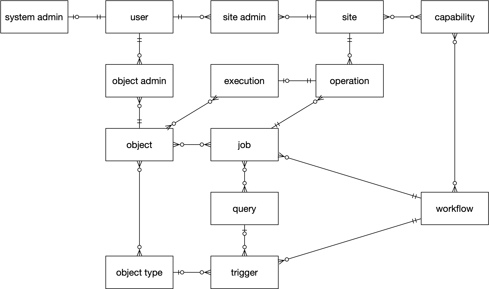

# NMDC Runtime API Resource Diagram

The above diagram shows the various resources of the NMDC Runtime API and how they are related,
using ["crow’s foot"
notation](https://en.wikipedia.org/wiki/Entity%E2%80%93relationship_model#Crow's_foot_notation).

A ***system admin*** record enables a ***user*** to administer various resources. A system admin may
add/update sites, capabilities, workflows, objects, object types, triggers, and queries.

A ***site admin*** record enables a user to administer a ***site***. A site agent – a process
running on behalf of a site admin – can claim a job for a workflow if the site has the
***capabilities*** required to execute that workflow.

An ***object admin*** record enables a user to administer an ***object*** – to register it and keep
its access information up to data, and to tag it with ***object types***.

A ***trigger*** relates a workflow to an object type or to a query. If the runtime senses that one
or more objects newly have a trigger-registered object type – either objects are new, or type
annotations are new – then one or more triggers are activated. Similarly, if the runtime senses that
one or more trigger-registered ***queries*** are newly satisfied, then corresponding triggers are
activated. Then, the runtime examines the activated triggers and may create new ***jobs*** that are
each templated by a **workflow***. Each job is packaged with the IDs of any objects and queries that
a site will need to execute the job.

A site may claim a job for which it has the job workflow’s (i.e., the job template’s) required
capabilities. A workflow may have no required site capabilities (beyond the site being able to
access objects and queries provided by the runtime). An ***operation*** resource represents a
promise of job execution – a site should update the operation with a successful job ***execution***
record, or with an error record. The execution record should identify any objects that are its data
products. Operations may expire, and if they yielded a successful execution, that execution will
retain associations with the operation’s job and site.
