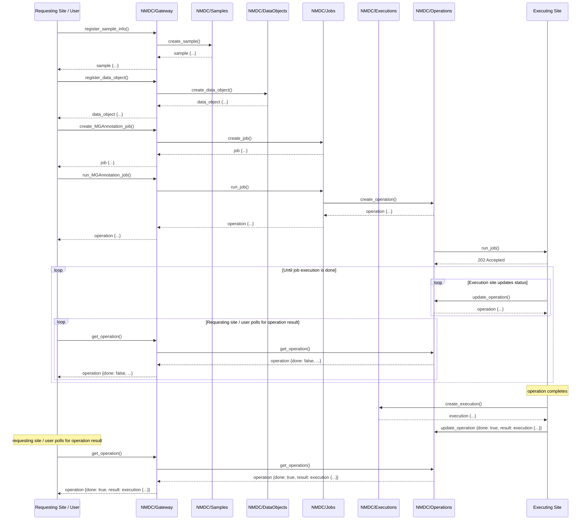

Sequence diagram ([Mermaid](https://mermaid-js.github.io/) syntax: [rendering](https://mermaid-js.github.io/mermaid-live-editor/#/view/eyJjb2RlIjoic2VxdWVuY2VEaWFncmFtXG4gICAgcGFydGljaXBhbnQgVXNlciBhcyBSZXF1ZXN0aW5nIFNpdGUgLyBVc2VyXG4gICAgcGFydGljaXBhbnQgTk1EQy9HYXRld2F5XG4gICAgcGFydGljaXBhbnQgTk1EQy9TYW1wbGVzXG4gICAgcGFydGljaXBhbnQgTk1EQy9EYXRhT2JqZWN0c1xuICAgIHBhcnRpY2lwYW50IE5NREMvSm9ic1xuICAgIHBhcnRpY2lwYW50IE5NREMvRXhlY3V0aW9uc1xuICAgIHBhcnRpY2lwYW50IE5NREMvT3BlcmF0aW9uc1xuICAgIHBhcnRpY2lwYW50IFNpdGUgYXMgRXhlY3V0aW5nIFNpdGVcblxuICAgIFVzZXItPj5OTURDL0dhdGV3YXk6IHJlZ2lzdGVyX3NhbXBsZV9pbmZvKClcbiAgICBOTURDL0dhdGV3YXktPj5OTURDL1NhbXBsZXM6IGNyZWF0ZV9zYW1wbGUoKVxuICAgIE5NREMvU2FtcGxlcy0tPj5OTURDL0dhdGV3YXk6IHNhbXBsZSB7Li4ufVxuICAgIE5NREMvR2F0ZXdheS0tPj5Vc2VyOiBzYW1wbGUgey4uLn1cblxuICAgIFVzZXItPj5OTURDL0dhdGV3YXk6IHJlZ2lzdGVyX2RhdGFfb2JqZWN0KClcbiAgICBOTURDL0dhdGV3YXktPj5OTURDL0RhdGFPYmplY3RzOiBjcmVhdGVfZGF0YV9vYmplY3QoKVxuICAgIE5NREMvRGF0YU9iamVjdHMtLT4-Tk1EQy9HYXRld2F5OiBkYXRhX29iamVjdCB7Li4ufVxuICAgIE5NREMvR2F0ZXdheS0tPj5Vc2VyOiBkYXRhX29iamVjdCB7Li4ufVxuXG4gICAgVXNlci0-Pk5NREMvR2F0ZXdheTogY3JlYXRlX01HQW5ub3RhdGlvbl9qb2IoKVxuICAgIE5NREMvR2F0ZXdheS0-Pk5NREMvSm9iczogY3JlYXRlX2pvYigpXG4gICAgTk1EQy9Kb2JzLS0-Pk5NREMvR2F0ZXdheTogam9iIHsuLi59XG4gICAgTk1EQy9HYXRld2F5LS0-PlVzZXI6IGpvYiB7Li4ufSBcblxuICAgIFVzZXItPj5OTURDL0dhdGV3YXk6IHJ1bl9NR0Fubm90YXRpb25fam9iKClcbiAgICBOTURDL0dhdGV3YXktPj5OTURDL0pvYnM6IHJ1bl9qb2IoKVxuICAgIE5NREMvSm9icy0-Pk5NREMvT3BlcmF0aW9uczogY3JlYXRlX29wZXJhdGlvbigpXG4gICAgTk1EQy9PcGVyYXRpb25zLS0-Pk5NREMvSm9iczogb3BlcmF0aW9uIHsuLi59XG4gICAgTk1EQy9Kb2JzLS0-Pk5NREMvR2F0ZXdheTogb3BlcmF0aW9uIHsuLi59XG4gICAgTk1EQy9HYXRld2F5LS0-PlVzZXI6IG9wZXJhdGlvbiB7Li4ufSBcbiAgICBOTURDL09wZXJhdGlvbnMtPj5TaXRlOiBydW5fam9iKClcbiAgICBTaXRlLS0-Pk5NREMvT3BlcmF0aW9uczogMjAyIEFjY2VwdGVkXG4gICAgXG4gICAgXG4gICAgbG9vcCBVbnRpbCBqb2IgZXhlY3V0aW9uIGlzIGRvbmVcbiAgICAgICAgbG9vcCBFeGVjdXRpb24gc2l0ZSB1cGRhdGVzIHN0YXR1c1xuICAgICAgICAgICAgU2l0ZS0-Pk5NREMvT3BlcmF0aW9uczogdXBkYXRlX29wZXJhdGlvbigpXG4gICAgICAgICAgICBOTURDL09wZXJhdGlvbnMtLT4-U2l0ZTogb3BlcmF0aW9uIHsuLi59XG4gICAgICAgIGVuZFxuICAgICAgICBsb29wIFJlcXVlc3Rpbmcgc2l0ZSAvIHVzZXIgcG9sbHMgZm9yIG9wZXJhdGlvbiByZXN1bHRcbiAgICAgICAgICAgIFVzZXItPj5OTURDL0dhdGV3YXk6IGdldF9vcGVyYXRpb24oKVxuICAgICAgICAgICAgTk1EQy9HYXRld2F5LT4-Tk1EQy9PcGVyYXRpb25zOiBnZXRfb3BlcmF0aW9uKClcbiAgICAgICAgICAgIE5NREMvT3BlcmF0aW9ucy0tPj5OTURDL0dhdGV3YXk6IG9wZXJhdGlvbiB7ZG9uZTogZmFsc2UsIC4uLn1cbiAgICAgICAgICAgIE5NREMvR2F0ZXdheS0tPj5Vc2VyOiBvcGVyYXRpb24ge2RvbmU6IGZhbHNlLCAuLi59XG4gICAgICAgIGVuZFxuICAgIGVuZFxuICAgIE5vdGUgb3ZlciBTaXRlOiBvcGVyYXRpb24gY29tcGxldGVzXG4gICAgU2l0ZS0-Pk5NREMvRXhlY3V0aW9uczogY3JlYXRlX2V4ZWN1dGlvbigpXG4gICAgTk1EQy9FeGVjdXRpb25zLS0-PlNpdGU6IGV4ZWN1dGlvbiB7Li4ufVxuICAgIFNpdGUtPj5OTURDL09wZXJhdGlvbnM6IHVwZGF0ZV9vcGVyYXRpb24ge2RvbmU6IHRydWUsIHJlc3VsdDogZXhlY3V0aW9uIHsuLi59fVxuICAgIFxuICAgIE5vdGUgb3ZlciBVc2VyOiByZXF1ZXN0aW5nIHNpdGUgLyB1c2VyIHBvbGxzIGZvciBvcGVyYXRpb24gcmVzdWx0XG4gICAgVXNlci0-Pk5NREMvR2F0ZXdheTogZ2V0X29wZXJhdGlvbigpXG4gICAgTk1EQy9HYXRld2F5LT4-Tk1EQy9PcGVyYXRpb25zOiBnZXRfb3BlcmF0aW9uKClcbiAgICBOTURDL09wZXJhdGlvbnMtLT4-Tk1EQy9HYXRld2F5OiBvcGVyYXRpb24ge2RvbmU6IHRydWUsIHJlc3VsdDogZXhlY3V0aW9uIHsuLi59fVxuICAgIE5NREMvR2F0ZXdheS0tPj5Vc2VyOiBvcGVyYXRpb24ge2RvbmU6IHRydWUsIHJlc3VsdDogZXhlY3V0aW9uIHsuLi59fSIsIm1lcm1haWQiOnt9LCJ1cGRhdGVFZGl0b3IiOmZhbHNlfQ))

