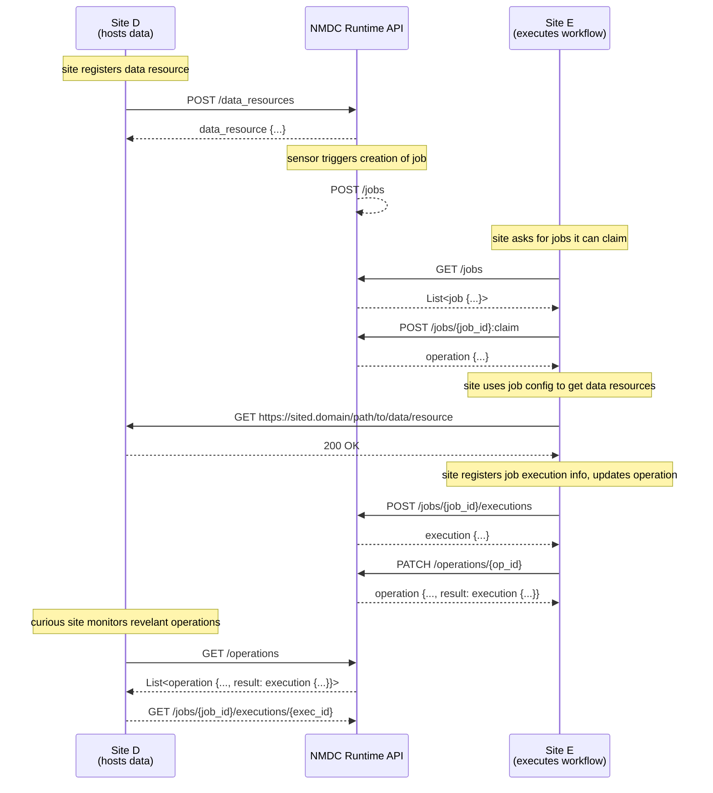

## Glossary of Terms

Referenced in sequence diagram below.

* operations:

    * "promises" or "futures" that act as a tool for tracking work being done in the background by
      an API service.
      
    * parameterized, returning a result type and a metadata type for storing progress information
      
    * they eventually "resolve" to a result or an error
      
    * it may be allowed to pause/resume/cancel them
      
    * they may expire, i.e. not stored indefinitely

* jobs:

    * first created and configured. later executed.
      
    * isolate workflow configuration from execution

* executions:

    * the result of a job resource that was run, when the job doesn't update or create an existing
      (API) resource
      
    * sub-resources of job resources
      
    * may be listed and retrieved by requesting sites / users, but only created and updated by
      executing sites

## Sequence diagram ([Mermaid](https://mermaid-js.github.io/) syntax)

[![](https://mermaid.ink/img/eyJjb2RlIjoic2VxdWVuY2VEaWFncmFtXG4gICAgcGFydGljaXBhbnQgRFNpdGUgYXMgU2l0ZSBEPGJyLz4oaG9zdHMgZGF0YSlcbiAgICBwYXJ0aWNpcGFudCBBUEkgYXMgTk1EQyBSdW50aW1lIEFQSVxuICAgIHBhcnRpY2lwYW50IEVTaXRlIGFzIFNpdGUgRTxici8-KGV4ZWN1dGVzIHdvcmtmbG93KVxuXG4gICAgTm90ZSBvdmVyIERTaXRlOiBzaXRlIHJlZ2lzdGVycyBkYXRhIHJlc291cmNlXG4gICAgRFNpdGUtPj5BUEk6IFBPU1QgL2RhdGFfcmVzb3VyY2VzXG4gICAgQVBJLS0-PkRTaXRlOiBkYXRhX3Jlc291cmNlIHsuLi59XG4gICAgTm90ZSBvdmVyIEFQSTogc2Vuc29yIHRyaWdnZXJzIGNyZWF0aW9uIG9mIGpvYlxuICAgIEFQSS0tPj5BUEk6IFBPU1QgL2pvYnNcblxuICAgIE5vdGUgb3ZlciBFU2l0ZTogc2l0ZSBhc2tzIGZvciBqb2JzIGl0IGNhbiBjbGFpbVxuICAgIEVTaXRlLT4-QVBJOiBHRVQgL2pvYnNcbiAgICBBUEktLT4-RVNpdGU6IExpc3Q8am9iIHsuLi59PlxuICAgIEVTaXRlLT4-QVBJOiBQT1NUIC9qb2JzL3tqb2JfaWR9OmNsYWltICAgIFxuICAgIEFQSS0tPj5FU2l0ZTogb3BlcmF0aW9uIHsuLi59XG5cbiAgICBOb3RlIG92ZXIgRVNpdGU6IHNpdGUgdXNlcyBqb2IgY29uZmlnIHRvIGdldCBkYXRhIHJlc291cmNlc1xuICAgIEVTaXRlLT4-RFNpdGU6IEdFVCBodHRwczovL3NpdGVkLmRvbWFpbi9wYXRoL3RvL2RhdGEvcmVzb3VyY2VcbiAgICBEU2l0ZS0tPj5FU2l0ZTogMjAwIE9LXG5cbiAgICBcbiAgICBOb3RlIG92ZXIgRVNpdGU6IHNpdGUgcmVnaXN0ZXJzIGpvYiBleGVjdXRpb24gaW5mbywgdXBkYXRlcyBvcGVyYXRpb25cbiAgICBFU2l0ZS0-PkFQSTogUE9TVCAvam9icy97am9iX2lkfS9leGVjdXRpb25zXG4gICAgQVBJLS0-PkVTaXRlOiBleGVjdXRpb24gey4uLn1cbiAgICBFU2l0ZS0-PkFQSTogUEFUQ0ggL29wZXJhdGlvbnMve29wX2lkfVxuICAgIEFQSS0tPj5FU2l0ZTogb3BlcmF0aW9uIHsuLi4sIHJlc3VsdDogZXhlY3V0aW9uIHsuLi59fVxuICAgIFxuICAgIE5vdGUgb3ZlciBEU2l0ZTogY3VyaW91cyBzaXRlIG1vbml0b3JzIHJldmVsYW50IG9wZXJhdGlvbnNcbiAgICBEU2l0ZS0-PkFQSTogR0VUIC9vcGVyYXRpb25zXG4gICAgQVBJLS0-PkRTaXRlOiBMaXN0PG9wZXJhdGlvbiB7Li4uLCByZXN1bHQ6IGV4ZWN1dGlvbiB7Li4ufX0-XG4gICAgRFNpdGUtLT4-QVBJOiBHRVQgL2pvYnMve2pvYl9pZH0vZXhlY3V0aW9ucy97ZXhlY19pZH0iLCJtZXJtYWlkIjp7fSwidXBkYXRlRWRpdG9yIjpmYWxzZX0)](https://mermaid-js.github.io/mermaid-live-editor/#/edit/eyJjb2RlIjoic2VxdWVuY2VEaWFncmFtXG4gICAgcGFydGljaXBhbnQgRFNpdGUgYXMgU2l0ZSBEPGJyLz4oaG9zdHMgZGF0YSlcbiAgICBwYXJ0aWNpcGFudCBBUEkgYXMgTk1EQyBSdW50aW1lIEFQSVxuICAgIHBhcnRpY2lwYW50IEVTaXRlIGFzIFNpdGUgRTxici8-KGV4ZWN1dGVzIHdvcmtmbG93KVxuXG4gICAgTm90ZSBvdmVyIERTaXRlOiBzaXRlIHJlZ2lzdGVycyBkYXRhIHJlc291cmNlXG4gICAgRFNpdGUtPj5BUEk6IFBPU1QgL2RhdGFfcmVzb3VyY2VzXG4gICAgQVBJLS0-PkRTaXRlOiBkYXRhX3Jlc291cmNlIHsuLi59XG4gICAgTm90ZSBvdmVyIEFQSTogc2Vuc29yIHRyaWdnZXJzIGNyZWF0aW9uIG9mIGpvYlxuICAgIEFQSS0tPj5BUEk6IFBPU1QgL2pvYnNcblxuICAgIE5vdGUgb3ZlciBFU2l0ZTogc2l0ZSBhc2tzIGZvciBqb2JzIGl0IGNhbiBjbGFpbVxuICAgIEVTaXRlLT4-QVBJOiBHRVQgL2pvYnNcbiAgICBBUEktLT4-RVNpdGU6IExpc3Q8am9iIHsuLi59PlxuICAgIEVTaXRlLT4-QVBJOiBQT1NUIC9qb2JzL3tqb2JfaWR9OmNsYWltICAgIFxuICAgIEFQSS0tPj5FU2l0ZTogb3BlcmF0aW9uIHsuLi59XG5cbiAgICBOb3RlIG92ZXIgRVNpdGU6IHNpdGUgdXNlcyBqb2IgY29uZmlnIHRvIGdldCBkYXRhIHJlc291cmNlc1xuICAgIEVTaXRlLT4-RFNpdGU6IEdFVCBodHRwczovL3NpdGVkLmRvbWFpbi9wYXRoL3RvL2RhdGEvcmVzb3VyY2VcbiAgICBEU2l0ZS0tPj5FU2l0ZTogMjAwIE9LXG5cbiAgICBcbiAgICBOb3RlIG92ZXIgRVNpdGU6IHNpdGUgcmVnaXN0ZXJzIGpvYiBleGVjdXRpb24gaW5mbywgdXBkYXRlcyBvcGVyYXRpb25cbiAgICBFU2l0ZS0-PkFQSTogUE9TVCAvam9icy97am9iX2lkfS9leGVjdXRpb25zXG4gICAgQVBJLS0-PkVTaXRlOiBleGVjdXRpb24gey4uLn1cbiAgICBFU2l0ZS0-PkFQSTogUEFUQ0ggL29wZXJhdGlvbnMve29wX2lkfVxuICAgIEFQSS0tPj5FU2l0ZTogb3BlcmF0aW9uIHsuLi4sIHJlc3VsdDogZXhlY3V0aW9uIHsuLi59fVxuICAgIFxuICAgIE5vdGUgb3ZlciBEU2l0ZTogY3VyaW91cyBzaXRlIG1vbml0b3JzIHJldmVsYW50IG9wZXJhdGlvbnNcbiAgICBEU2l0ZS0-PkFQSTogR0VUIC9vcGVyYXRpb25zXG4gICAgQVBJLS0-PkRTaXRlOiBMaXN0PG9wZXJhdGlvbiB7Li4uLCByZXN1bHQ6IGV4ZWN1dGlvbiB7Li4ufX0-XG4gICAgRFNpdGUtLT4-QVBJOiBHRVQgL2pvYnMve2pvYl9pZH0vZXhlY3V0aW9ucy97ZXhlY19pZH0iLCJtZXJtYWlkIjp7fSwidXBkYXRlRWRpdG9yIjpmYWxzZX0)

