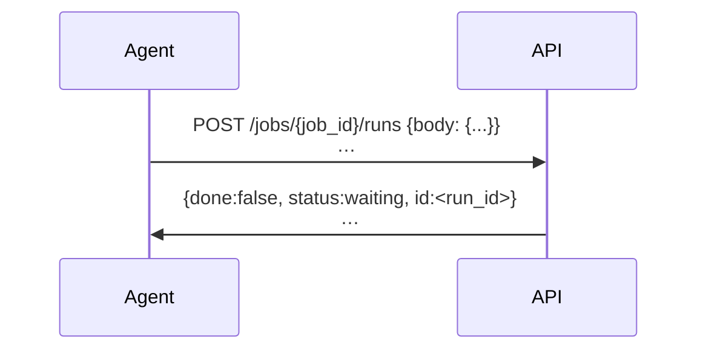
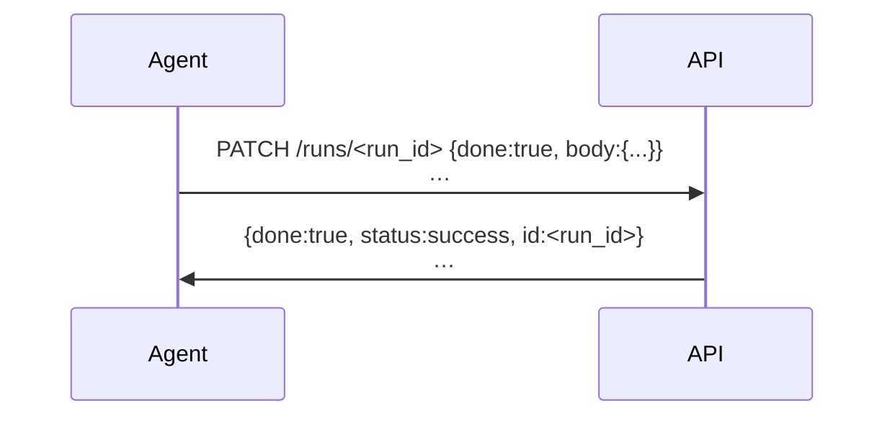
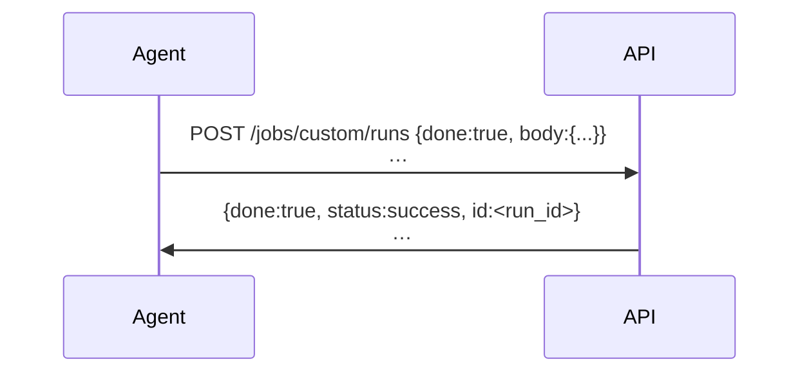
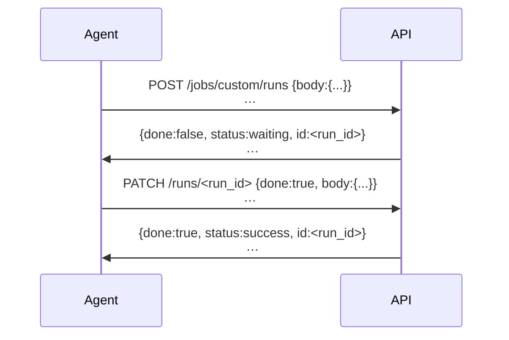

# [Draft] API Simplification

The following is a draft proposal to simplify the design of the Runtime API.

## Job run &mdash;(1:N)&mdash; metadata submission

Every metadata submission is associated with a job run. There is a special `custom` job in case you
cannot associate your submission with a known job-to-be-done for a known workflow. You can mark a
job for which you are submitting metadata as already done, so that you need only send one API
request. See the sequence diagrams below for more elaboration on this.

## Branch and merge

All metadata submitted as part of a job run is staged separately from the main, validated metadata.
You can consider each job run as having a "branch" that stores only how it differs from the "main"
metadata.

When a job run is marked `done:true`, that triggers a "pull request" to merge the job-run branch
into the main branch. It is at this point that arbitrary integrity checks can be performed against
the proposed new whole of the metadata, and that any JSON Schema validation failure will cause a
merge error. Before a job run is marked done, metadata submissions for the run that fail schema
validation will return warnings, but the submission will be accepted.

## Example: Registering a run of a workflow job, and submitting metadata for the run

There is no need to "claim" a job. If you see a job you want to run, or that you have already run,
then POST a new (`done:false`, the default) run for the job `job_id` so that your intent is
registered. You may also provide metadata (in the POST `body`) associated with the job run. You will
get back an run ID `run_id` to continue informing the Runtime about the status of and metadata for
the job run. The `status` of the job run is that it is waiting to be marked `done:true`.

## Example: Submitting metadata associated with a job run, and marking it done

When you have more metadata related to a job run, submit it by PATCHing the run ID `run_id`
that represents the job run. If the run is done and there is no more metadata to submit,
PATCH the run as `done:true`.

## Example: One-off custom metadata submission

There is an evergreen job, with a `job_id` of `custom`, for custom metadata submission not
associated with a specific job for a known workflow. For example, if you want to submit metadata
collected from a spreadsheet that represent one-off corrections or additions, you may accomplish
this with a single `custom` job run POST.

## Example: Multi-step custom metadata submission

Just like with any job, you may spread metadata submissions for a `custom` job over multiple
sessions, as long as you retain the run ID `run_id`. The benefit of the multi-step flow is that
your metadata need only be schema-compliant when you mark the run as `done:true`, that is,
when you wish to merge your submission as a whole into the main database.

