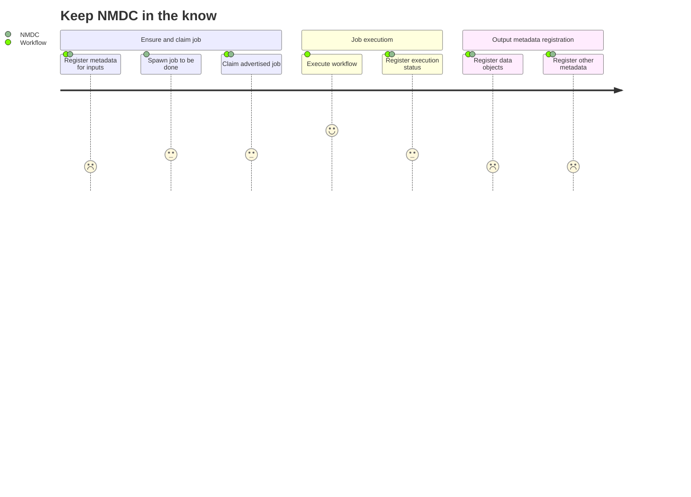
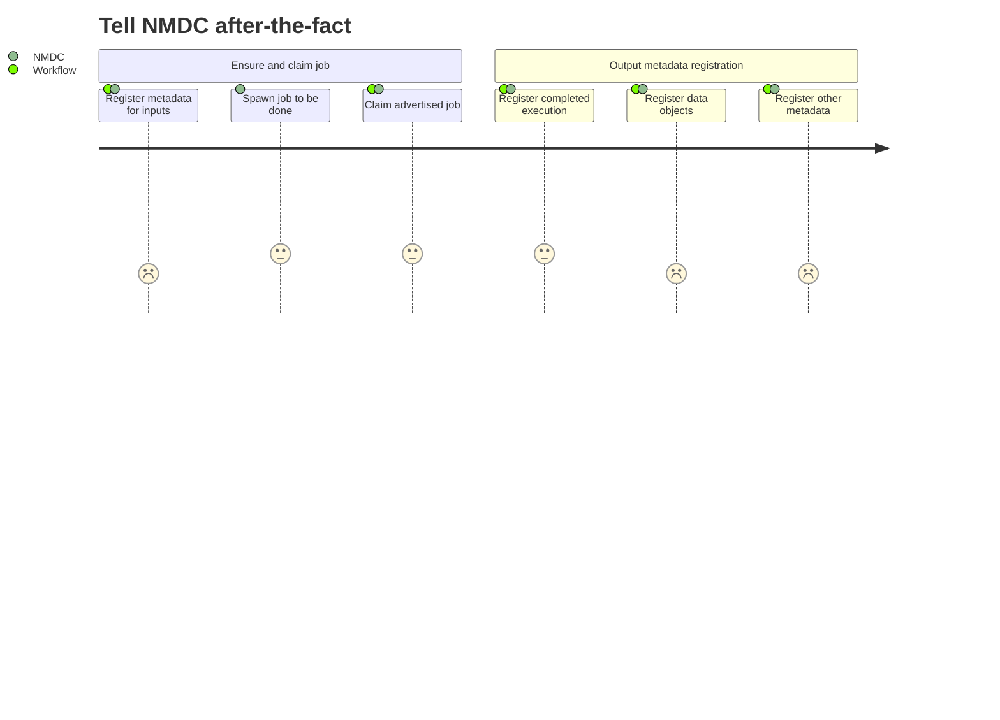
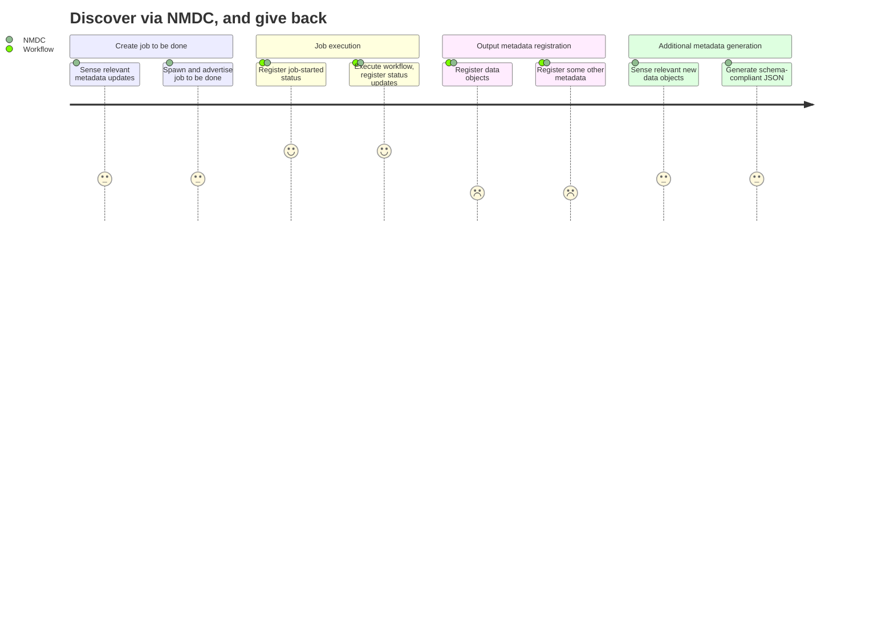

# User Journeys

```mermaid
journey
    title Keep NMDC in the know
    section Ensure and claim job
      Register metadata for inputs: 2: Workflow, NMDC
      Spawn job to be done: 3: NMDC
      Claim advertised job: 3: Workflow, NMDC
    section Job executiom
      Execute workflow: 5: Workflow
      Register execution status: 3: Workflow, NMDC
    section Output metadata registration
      Register data objects: 2: Workflow, NMDC
      Register other metadata: 2: Workflow, NMDC
```

```mermaid
journey
    title Tell NMDC after-the-fact
    section Ensure and claim job
      Register metadata for inputs: 2: Workflow, NMDC
      Spawn job to be done: 3: NMDC
      Claim advertised job: 3: Workflow, NMDC
    section Output metadata registration
      Register completed execution: 3: Workflow, NMDC
      Register data objects: 2: Workflow, NMDC
      Register other metadata: 2: Workflow, NMDC
```

```mermaid
journey
    title Discover via NMDC, and give back
    section Create job to be done
      Sense relevant metadata updates: 3: NMDC
      Spawn and advertise job to be done: 3: NMDC
    section Job execution
      Register job-started status: 5: Workflow, NMDC
      Execute workflow, register status updates: 5: Workflow, NMDC
    section Output metadata registration
      Register data objects: 2: Workflow, NMDC
      Register some other metadata: 2: Workflow, NMDC
    section Additional metadata generation
      Sense relevant new data objects: 3: NMDC
      Generate schema-compliant JSON: 3: NMDC
```