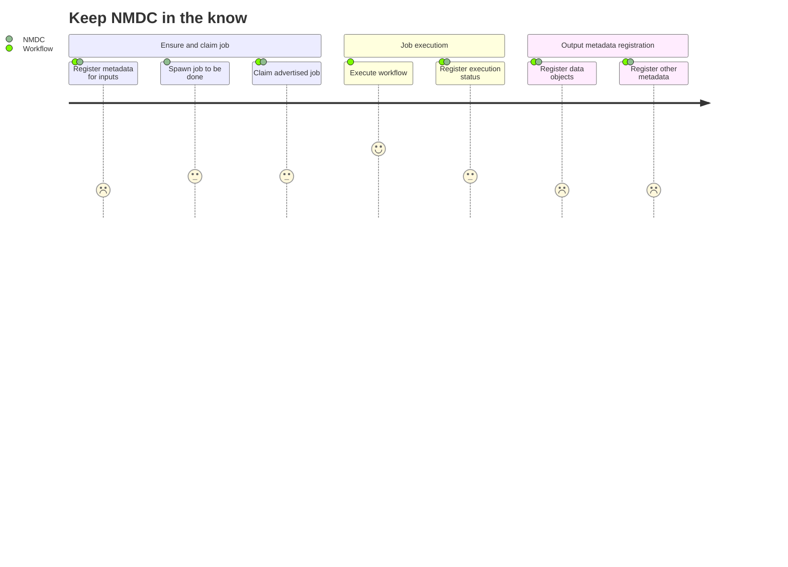
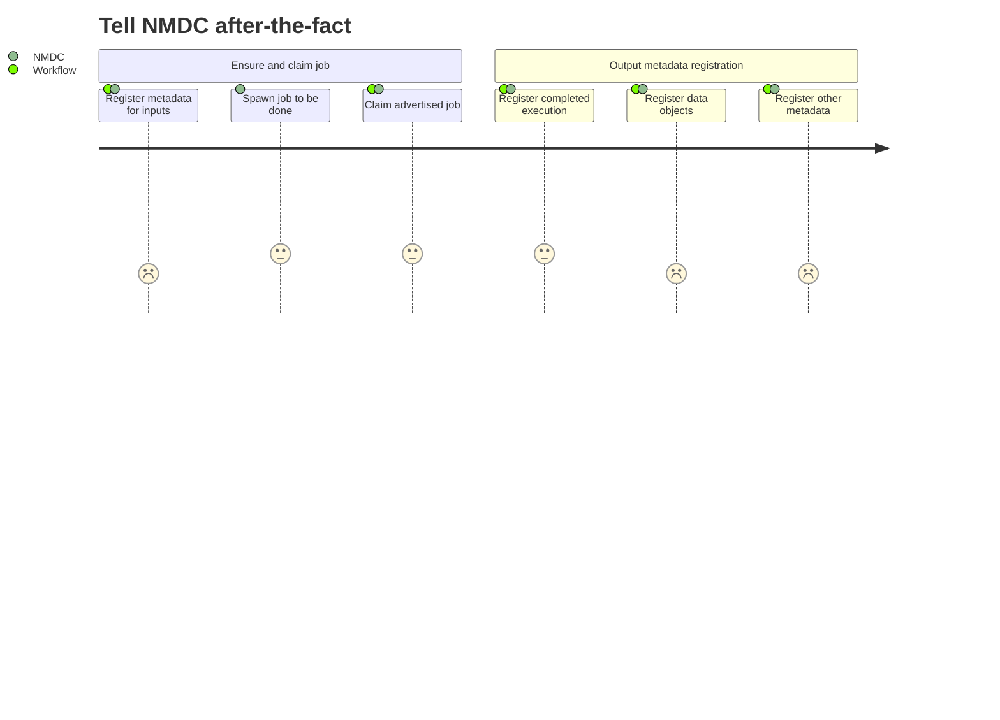
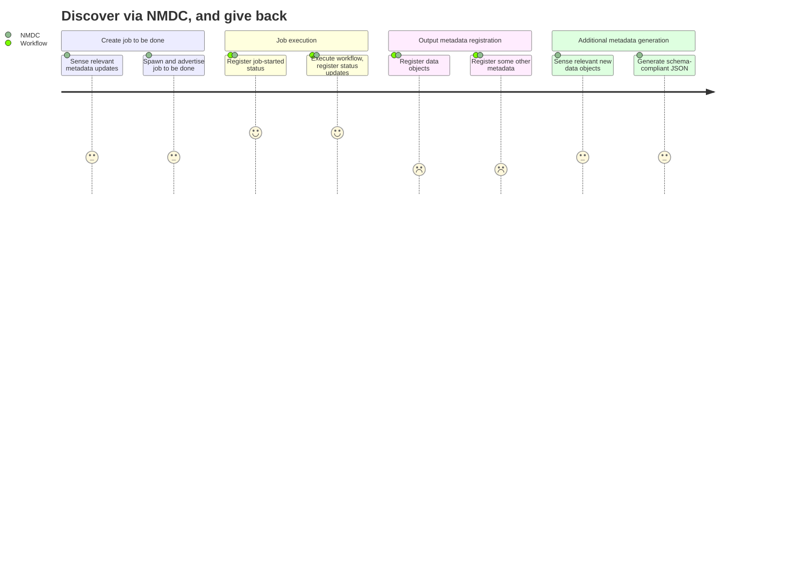

# User Journeys

Re: "do workflows need to know NMDC specifics", I've drafted a set of user journey diagrams with
"Workflow" and "NMDC" as actors.

The first, "Keep NMDC in the know", is the current intended Workflow executioner journey, and is
implemented by the NMDC Runtime:

The second journey, "Tell NMDC after-the-fact", is also currently supported by the implementation,
and is similar to the first journey, but there is no real-time provenance / status update reporting:

The third journey, "Discover via NMDC, and give back", is aspirational. In current practice,
Workflow executioners already know what they want to do, already know the relevant input data
objects / metadata, and are simply informing the Runtime of what they did / are doing in the
language of the NMDC schema. This last journey reflects some feedback we've gotten. For example,
folks would like to register transformation functions with NMDC so that NMDC can e.g. generate
schema-complaint JSON from a workflow's native GFF output files:

