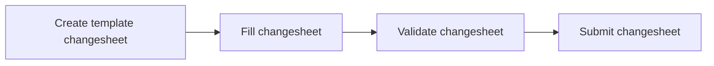

# Authoring Changesheets

## Introduction

Changesheets is a mechanism to perform CRUD, i.e., Create, Read, Update, Delete operations on the NMDC MongoDB database that is exposed via the [nmdc-runtime API](https://api.dev.microbiomedata.org/docs).

A changesheet, like the name tells us, is a sheet, more specifically, a TSV file with pre defined column names that a user can fill out appropriately and submit via the API.

## Changesheet Workflow

The various steps that are involved in a typical changesheet workflow are as summarized in the below flowchart.

1. The first step is to create a TSV file that follows the standard changesheet template. A changesheet has the following columns:

    * `id`: The "id" field value of the JSON record in the database that is to be changed. It may be a biosample, study, project, etc.
    * `action`: Action to be performed on the database. It may be one of the following: 
        * `insert items`: Add new values to a multi-valued field of a particular record. Aliases: `insert`, `insert item`.
        * `remove items`: Remove attributes from a particular record.  Aliases: `remove item`.
        * `update`: Update field on a record with a new value. Aliases: `set`, `replace`, `replace items`.
    * `attribute`: the field name of the NMDC JSON record that is to be modified. Reference: [NMDC JSON Schema](https://github.com/microbiomedata/nmdc-schema/blob/main/nmdc_schema/nmdc.schema.json).
    * `value`: New value, which may be added (if it wasn't present already) to a multi-valued field for an `insert` action. For an `update` action, it will overwrite any current value.

2. The second step is to fill our the columns in the above changesheet appropriately.

    !!! note
        For any property with some substructure, such as the [`doi`](https://microbiomedata.github.io/nmdc-schema/doi/) field, you can specify a symbolic name in the `value` column of the changesheet, say something like `v1`. Then you can specify a property on `v1`. For example, `doi` has a sub property called `has_raw_value` which can be specified in the `attribute` column of the changesheet, and then some value provided for that. [Example changesheet using symbolic names](https://github.com/microbiomedata/nmdc-runtime/blob/main/metadata-translation/notebooks/data/changesheet-without-separator3.tsv).

3. The third step is to use the validation endpoint from the nmdc-runtime API which you can find [here](https://api.dev.microbiomedata.org/docs#/metadata/validate_changesheet_metadata_changesheets_validate_post). Click on `Try it out`, and upload your TSV file. You should see a `200` successful response for proper validation.

4. The fourth and final step in the protocol is to actually submit the changesheet using the submission endpoint from the nmdc-runtime API which you can find [here](https://api.dev.microbiomedata.org/docs#/metadata/submit_changesheet_metadata_changesheets_submit_post). For this, you must be logged in using your username/password (click on any lock icon) and authorized to submit changesheets. Click on `Try it out`, and upload your TSV file. Similar to the validation endpoint, you should see a `200` successful response on execution the request. For an example submission changesheet, see [here](https://github.com/microbiomedata/nmdc-runtime/blob/main/metadata-translation/notebooks/data/changesheet-without-separator3.tsv).

!!! note
    The submission endpoint runs the validation endpoint prior to actually submitting the data.

