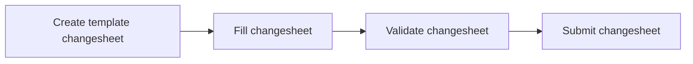

# Authoring Changesheets

## Introduction

Changesheets is a mechanism to perform CRUD, i.e., Create, Read, Update, Delete operations on the NMDC MongoDB database that is exposed via the [nmdc-runtime API](https://api.dev.microbiomedata.org/docs).

A changesheet, like the name tells us, is a sheet, more specifically, a TSV file with pre defined column names that a user can fill out appropriately and submit via the API.

## Changesheet Workflow

The various steps that are involved in a typical changesheet workflow are as summarized in the below flowchart.

1. The first step is to create a TSV file that follows the standard changesheet template. A changesheet has the following four columns:
* `id`: JSON record in the database that is to be changed. It may be a biosample, study, project, etc.
* `action`: Action to be performed on the database. It may be one of the following: 
  * `insert items`: Add new attributes on a particular record
  * `remove items`: Remove attributes from a particular record
  * `update`: Update field on a record with a new value
* `attribute`: JSON key, or NMDC record field that is to be modified
* `value`: New value with which the old value on a particular attribute is to be overwritten

2. The second step is to fill our the columns in the above changesheet appropriately.

Note: For any property with some substructure, like the `doi` field say, you can specify a symbolic name in the `value` column of the changesheet, say something like `v1`. Then you can specify a property on `v1`. For example, `doi` has a sub property called `has_raw_value` which can be specified in the `attribute` column of the changesheet, and then some value provided for that.

3. The third step is to use the validation endpoint from the nmdc-runtime API which you can find [here](https://api.dev.microbiomedata.org/docs#/metadata/validate_changesheet_metadata_changesheets_validate_post). Click on `Try it out`, and upload your TSV file. You should see a `200` successful response for proper validation.

4. The fourth and final step in the protocol is to actually submit the changesheet using the submission endpoint from the nmdc-runtime API which you can find [here](https://api.dev.microbiomedata.org/docs#/metadata/submit_changesheet_metadata_changesheets_submit_post). Click on `Try it out`, and upload your TSV file. Similar to the validation endpoint, you should see a `200` successful response on execution the request. For an example submission changesheet, see here.

_Note_: The submission endpoint runs the validation endpoint prior to actually submitting the data.

For an example changesheet to test the validation and submission endpoints on, see For an example changesheet that you can test the validation endpoint on, see [here](https://github.com/microbiomedata/nmdc-runtime/blob/main/metadata-translation/notebooks/data/changesheet-without-separator3.tsv).
