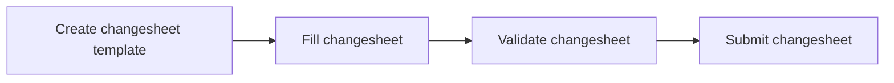

# Authoring Changesheets

## Introduction

Changesheets is a mechanism to update records (JSON documents) that have already been ingested into MongoDB. Meaning, you can *update* an already ingested document - you can *insert* new keys on a document, *delete/remove* certain keys on a document, or even update the value corresponding to a key in a document. But it is important to note that you cannot *create/delete* whole new JSON documents via changesheets.

If you look at the changesheet workflow diagram below, you'll see that there are two main steps in the workflow - validation of the changesheet, and upon successful validation, submission of the changesheet.

There are two endpoints in the NMDC runtime API infrastructure that you can use:

* validation: `/metadata/changesheets:validate`
* submission: `/metadata/changesheets:submit`

The Swagger UI, which is one of the ways in which you can interact with the suite of endpoints that the runtime API provides and which also serves as the primary API documentation reference, is accessible here: [https://api.microbiomedata.org/docs](https://api.microbiomedata.org/docs).

Changesheets are typically specified as TSV files with pre-defined column names. There are four columns that need to be defined - *id*, *action*, *attribute* and *value*.

## Changesheet Workflow

The various steps that are involved in a typical changesheet workflow are as summarized in the below flowchart.

1. The first step is to create a TSV file that follows the standard changesheet template. A changesheet has the following columns:

    * `id`: The *id* value corresponding to the *id* of the JSON document in the database. Specifying this will tell the changesheet what record in the database needs to be modified. There are no restrictions on the ids that can be modified. For example, it can be a Biosample *id* (with typecode *bsm*), or a Study *id* (with typecode *sty*), or another class of *id*.
    * `action`: The action to be performed on the database. It may be one of the following: 
        * `insert` / `insert item` / `insert items`: Add new values to a multivalued field, i.e., a field/key on a document which captures a list of values instead of single values.
        * `remove`: Drop a key/value pair for a single-value slot. Leave `value` field empty on changesheet.
        * `remove item` / `remove items`: Remove item(s) from a list/set of values for a multivalued slot. 
        * `update` / `set` / `replace` / `replace items`: Update the value of a particular field/key on a document and replace it with a new value.
    * `attribute`: the name of the field/key in the NMDC JSON document that is to be modified.
    * `value`: New value, which may be added (if it wasn't present already) to a multi-valued field for an `insert` action. For an `update` action, it will overwrite any current value.

2. The second step is to fill out the rows of your changesheet appropriately as described above.

    !!! note
        A couple of notes to keep in mind when you are modifying a key in your document, the value of which has some substructure to it:
    
        * If you are modifying/replacing the value of a key in a document which has a *dictionary* structure, and you want to modify individual keys/attributes in that dictionary, then changesheets employs a dot syntax to indicate those. For example, if you wanted to modify a field called [depth](https://microbiomedata.github.io/nmdc-schema/depth/) within the records in the `biosample_set` collection, and specifically the `has_numeric_value` portion that can be asserted on *depth* fields, then the `attribute` column would have a value like this: `depth.has_numeric_value`. Another way in which you can rewrite the same syntax as above is by using symbolic names. Consider another field called [doi](https://microbiomedata.github.io/nmdc-schema/doi/) which is a key on documents in the `study_set` collection. You can specify a symbolic name in the `value` column of the changesheet, say something like `v1`. Then you can specify what attribute of the substructure you want to modify on another row for `v1` in the changesheet. Let's say you want to modify the `has_raw_value` component of the `doi`, then you would simply indicate `has_raw_value` in the *attribute* column of the changesheet (on the row corresponding to `v1`). You can find an example of a changesheet using symbolic names [here](https://github.com/microbiomedata/nmdc-runtime/blob/main/metadata-translation/notebooks/data/changesheet-without-separator3.tsv).
        * If you are modifying/replacing the value of a key in a document which has a *list* structure, then specifying a single value in the *value* column of the changesheet will be interpreted as a single element list. If you wanted to replace it with a multi-element list, then you can specify the individual elements of that list value in a pipe (`|`) delimited fashion in the *value* column of the changesheet

3. The third step is to use the validation endpoint from the runtime API which you can find [here](https://api.microbiomedata.org/docs#/metadata/validate_changesheet_metadata_changesheets_validate_post). Click on *Try it out*, and upload your TSV file. You should see a `200` successful response for proper validation.

4. The fourth and final step in the protocol is to actually submit the changesheet using the submission endpoint from the nmdc-runtime API which you can find [here](https://api.microbiomedata.org/docs#/metadata/submit_changesheet_metadata_changesheets_submit_post). For this, you must be logged in using your username/password (click on any lock icon) and authorized to submit changesheets. Click on *Try it out*, and upload your TSV file. Similar to the validation endpoint, you should see a `200` successful response on execution the request. For an example submission changesheet, see [here](https://github.com/microbiomedata/nmdc-runtime/blob/main/metadata-translation/notebooks/data/changesheet-without-separator3.tsv).

!!! note
    The submission endpoint runs the validation endpoint prior to actually submitting the data.
