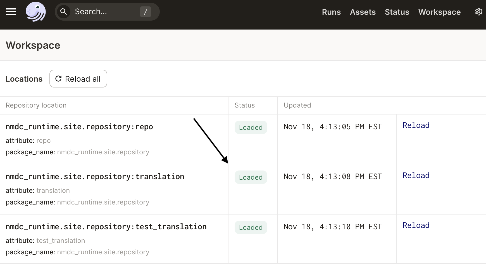
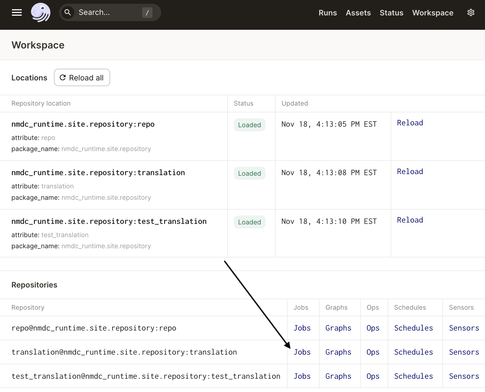
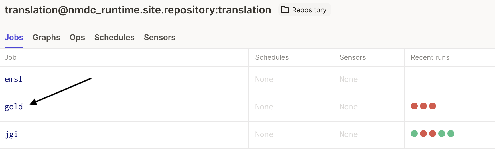
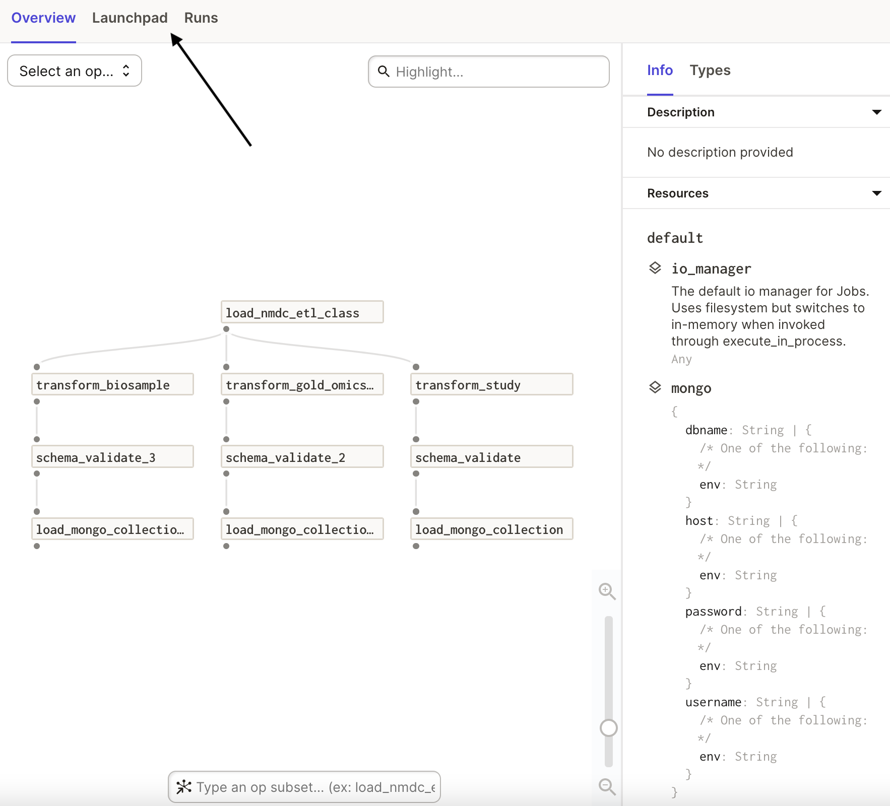
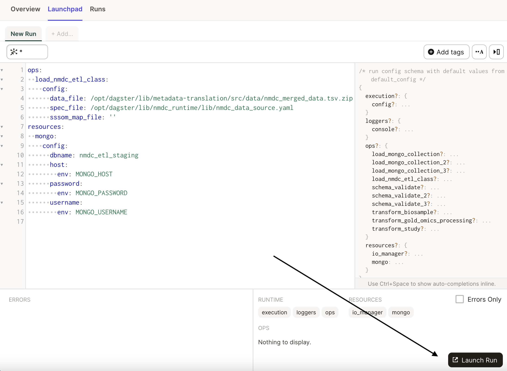

# GOLD Translation ETL


This job takes a `nmdc_merged_data.tsv.zip` file as a data object input.

First, start your local runtime stack:

```
make up-dev
```

Load <http://localhost:3000/workspace> and ensure the `translation` repository is loaded:




Next, navigate to the Jobs page for the `translation` repository:



And finally, select the `gold` job from the table:



This will bring you to an overview of the job. Specifically, you will see the *graph* of
*operations* that the job uses, as well as information about the *resources* needed for the
operations. Click on the `Lauchpad` tab to examine the job's configuration:



In the launchpad, we see the configuration for the job, which includes a reference to a
`nmdc_merged_data.tsv.zip` input file that was present in the nmdc-runtime git repository,
accessible via the `/opt/dagster/lib/` path. We also see a button to launch a run of the job, i.e. a
run of the graph of operations configured with the YAML shown:



This job is being run manually. Other jobs in the Runtime system may be launched via Dagster
*sensors* that `yield RunRequest(run_key=..., run_config=...)` in the body of the sensor logic.
Sensors can periodically (e.g. every ~30 seconds) poll the system for any activation conditions,
such as the presence of new data objects of certain types. A sensor may then yield a `RunRequest`
for an appropriate job with e.g. the data object ID in the job configuration.

Once this translation ETL job finishes successfully, there will be new NMDC-schema-compliant
metadata in your local MongoDB instance (which was also started by `make up-dev`). One option now is
to export this metadata using the `mongoexport` command-line tool. Here's an example of exporting
the `gold.biosample_set` collection and conforming it to the `nmdc:Database` JSON schema using the
`jq` tool:

```
mongoexport --host="localhost:27018" \
    -u admin -p root --authenticationDatabase admin \
    -d nmdc_etl_staging -c gold.biosample_set \
    --jsonArray -o gold.biosample_set.json
```
```
jq '{biosample_set:.}' gold.biosample_set.json \
    > gold.biosample_set.as_nmdcdb.2021-11-18.json
```

Now, you may [submit this metadata as JSON through the API](../tutorials/tutorial-metadata-in.md).

In the tutorial linked to above, GitHub's Gist service is used to host and obtain a URL for the
JSON. Here's let's walk through using the NMDC's `www` directory on NERSC to host the file and
obtain the URL, as well as obtain the sha256 hash and file size in bytes we need in order to create
a DRS object in the API:

```
# Use https://docs.nersc.gov/connect/mfa/#sshproxy
scp  gold.biosample_set.as_nmdcdb.2021-11-18.json \
    dtn01.nersc.gov:/global/cfs/cdirs/m3408/www/meta/
```
```
ssh dtn01.nersc.gov

cd /global/cfs/cdirs/m3408/www/meta/

# ensure world-readable
chmod 444 gold.biosample_set.as_nmdcdb.2021-11-18.json

# get sha256 checksum
openssl dgst -sha256 gold.biosample_set.as_nmdcdb.2021-11-18.json

# get bytes
du --bytes gold.biosample_set.as_nmdcdb.2021-11-18.json
```

Now, you can use the normal procedure to register the object, ensure the "metadata-in" tag, and
monitor the progress of the validation and ingest.