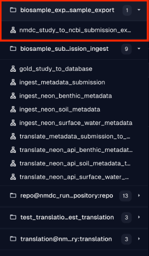

# Metadata Export Pipelines (Exporters)

## Introduction

Metadata export pipelines (often referred to as *exporters*) are pipelines that are run when we want to export out metadata (biosample, omics/sequencing, etc.) from the NMDC database into a format/serialization that is readable by another system (ex. NCBI Submission Portal). Target systems/databases that are currently supported, i.e., systems that we currently have pipelines for are:

* [NCBI Submission Portal](https://submit.ncbi.nlm.nih.gov/)

## Procedure

The steps below describe how to run the metadata export pipelines (*exporters*).

1. Go to either the development or production Dagit interface: https://dagit-dev.microbiomedata.org/ or https://dagit.microbiomedata.org/. If you're running Dagster locally through Docker containers, then go to http://localhost:3000/.
2. Find the hamburger button (`☰`) to the left, and a side panel should open up.
3. You will see a section in that panel called `biosample_export@nmdc_runtime.site.repository:biosample_export` under which you will see all the exporter pipelines that you can run.
4. 
5. Select any of the above pipelines, and click on the ***Launchpad*** tab/section.
6. You will see different configuration parameters that you need to fill out for different pipelines.
7. Once you're done filling out the configuration parameters, you can hit the ***Launch Run*** button at the bottom right of the screen, and monitor the progress of your run.
8. You can also track the history of all your past runs in the ***Runs*** tab/section.
9. You can retrieve the output of your pipeline by clicking on the right step in the Dagit console log panel which will allow you to preview the output.
   1. For example, for the NCBI XML exporter you will see an `ASSET_MATERIALIZATION` step in the Dagit console log that can click to preview the output and copy it into an appropriately named file, i.e., with the right extension.

## Additional Details

* `nmdc_study_to_ncbi_submission_export`: exporter to help you export metadata related to a given study in NMDC into an XML Submission file that is compliant with (i.e., can be submitted to) the NCBI Submission Portal.