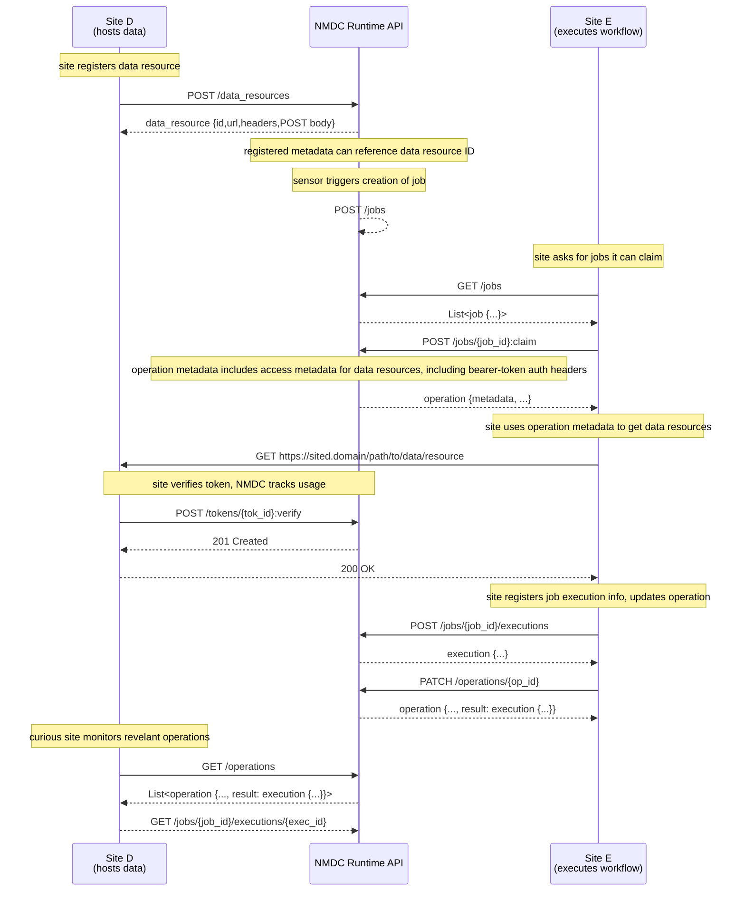

## Glossary of Terms

Referenced in sequence diagram below.

* operations:

    * "promises" or "futures" that act as a tool for tracking work being done in the background by
      an API service.
      
    * parameterized, returning a result type and a metadata type for storing progress information
      
    * they eventually "resolve" to a result or an error
      
    * it may be allowed to pause/resume/cancel them
      
    * they may expire, i.e. not stored indefinitely

* jobs:

    * first created and configured. later executed.
      
    * isolate workflow configuration from execution

* executions:

    * the result of a job resource that was run, when the job doesn't update or create an existing
      (API) resource
      
    * sub-resources of job resources
      
    * may be listed and retrieved by requesting sites / users, but only created and updated by
      executing sites

## Sequence diagram ([Mermaid](https://mermaid-js.github.io/) syntax)

[![](https://mermaid.ink/img/eyJjb2RlIjoic2VxdWVuY2VEaWFncmFtXG4gICAgcGFydGljaXBhbnQgRFNpdGUgYXMgU2l0ZSBEPGJyLz4oaG9zdHMgZGF0YSlcbiAgICBwYXJ0aWNpcGFudCBBUEkgYXMgTk1EQyBSdW50aW1lIEFQSVxuICAgIHBhcnRpY2lwYW50IEVTaXRlIGFzIFNpdGUgRTxici8-KGV4ZWN1dGVzIHdvcmtmbG93KVxuXG4gICAgTm90ZSBvdmVyIERTaXRlOiBzaXRlIHJlZ2lzdGVycyBkYXRhIHJlc291cmNlXG4gICAgRFNpdGUtPj5BUEk6IFBPU1QgL2RhdGFfcmVzb3VyY2VzXG4gICAgQVBJLS0-PkRTaXRlOiBkYXRhX3Jlc291cmNlIHtpZCx1cmwsaGVhZGVycyxQT1NUIGJvZHl9XG4gICAgTm90ZSBvdmVyIEFQSTogcmVnaXN0ZXJlZCBtZXRhZGF0YSBjYW4gcmVmZXJlbmNlIGRhdGEgcmVzb3VyY2UgSURcblxuICAgIE5vdGUgb3ZlciBBUEk6IHNlbnNvciB0cmlnZ2VycyBjcmVhdGlvbiBvZiBqb2JcbiAgICBBUEktLT4-QVBJOiBQT1NUIC9qb2JzXG5cbiAgICBOb3RlIG92ZXIgRVNpdGU6IHNpdGUgYXNrcyBmb3Igam9icyBpdCBjYW4gY2xhaW1cbiAgICBFU2l0ZS0-PkFQSTogR0VUIC9qb2JzXG4gICAgQVBJLS0-PkVTaXRlOiBMaXN0PGpvYiB7Li4ufT5cbiAgICBFU2l0ZS0-PkFQSTogUE9TVCAvam9icy97am9iX2lkfTpjbGFpbVxuICAgIE5vdGUgb3ZlciBBUEk6IG9wZXJhdGlvbiBtZXRhZGF0YSBpbmNsdWRlcyBhY2Nlc3MgbWV0YWRhdGEgZm9yIGRhdGEgcmVzb3VyY2VzLCBpbmNsdWRpbmcgYmVhcmVyLXRva2VuIGF1dGggaGVhZGVyc1xuICAgIEFQSS0tPj5FU2l0ZTogb3BlcmF0aW9uIHttZXRhZGF0YSwgLi4ufVxuXG4gICAgTm90ZSBvdmVyIEVTaXRlOiBzaXRlIHVzZXMgb3BlcmF0aW9uIG1ldGFkYXRhIHRvIGdldCBkYXRhIHJlc291cmNlc1xuICAgIEVTaXRlLT4-RFNpdGU6IEdFVCBodHRwczovL3NpdGVkLmRvbWFpbi9wYXRoL3RvL2RhdGEvcmVzb3VyY2VcbiAgICBOb3RlIG92ZXIgRFNpdGUsQVBJOiBzaXRlIHZlcmlmaWVzIHRva2VuLCBOTURDIHRyYWNrcyB1c2FnZVxuICAgIERTaXRlLT4-QVBJOiBQT1NUIC90b2tlbnMve3Rva19pZH06dmVyaWZ5XG4gICAgQVBJLS0-PkRTaXRlOiAyMDEgQ3JlYXRlZFxuICAgIERTaXRlLS0-PkVTaXRlOiAyMDAgT0tcblxuICAgIFxuICAgIE5vdGUgb3ZlciBFU2l0ZTogc2l0ZSByZWdpc3RlcnMgam9iIGV4ZWN1dGlvbiBpbmZvLCB1cGRhdGVzIG9wZXJhdGlvblxuICAgIEVTaXRlLT4-QVBJOiBQT1NUIC9qb2JzL3tqb2JfaWR9L2V4ZWN1dGlvbnNcbiAgICBBUEktLT4-RVNpdGU6IGV4ZWN1dGlvbiB7Li4ufVxuICAgIEVTaXRlLT4-QVBJOiBQQVRDSCAvb3BlcmF0aW9ucy97b3BfaWR9XG4gICAgQVBJLS0-PkVTaXRlOiBvcGVyYXRpb24gey4uLiwgcmVzdWx0OiBleGVjdXRpb24gey4uLn19XG4gICAgXG4gICAgTm90ZSBvdmVyIERTaXRlOiBjdXJpb3VzIHNpdGUgbW9uaXRvcnMgcmV2ZWxhbnQgb3BlcmF0aW9uc1xuICAgIERTaXRlLT4-QVBJOiBHRVQgL29wZXJhdGlvbnNcbiAgICBBUEktLT4-RFNpdGU6IExpc3Q8b3BlcmF0aW9uIHsuLi4sIHJlc3VsdDogZXhlY3V0aW9uIHsuLi59fT5cbiAgICBEU2l0ZS0tPj5BUEk6IEdFVCAvam9icy97am9iX2lkfS9leGVjdXRpb25zL3tleGVjX2lkfSIsIm1lcm1haWQiOnt9LCJ1cGRhdGVFZGl0b3IiOmZhbHNlfQ)](https://mermaid-js.github.io/mermaid-live-editor/#/edit/eyJjb2RlIjoic2VxdWVuY2VEaWFncmFtXG4gICAgcGFydGljaXBhbnQgRFNpdGUgYXMgU2l0ZSBEPGJyLz4oaG9zdHMgZGF0YSlcbiAgICBwYXJ0aWNpcGFudCBBUEkgYXMgTk1EQyBSdW50aW1lIEFQSVxuICAgIHBhcnRpY2lwYW50IEVTaXRlIGFzIFNpdGUgRTxici8-KGV4ZWN1dGVzIHdvcmtmbG93KVxuXG4gICAgTm90ZSBvdmVyIERTaXRlOiBzaXRlIHJlZ2lzdGVycyBkYXRhIHJlc291cmNlXG4gICAgRFNpdGUtPj5BUEk6IFBPU1QgL2RhdGFfcmVzb3VyY2VzXG4gICAgQVBJLS0-PkRTaXRlOiBkYXRhX3Jlc291cmNlIHtpZCx1cmwsaGVhZGVycyxQT1NUIGJvZHl9XG4gICAgTm90ZSBvdmVyIEFQSTogcmVnaXN0ZXJlZCBtZXRhZGF0YSBjYW4gcmVmZXJlbmNlIGRhdGEgcmVzb3VyY2UgSURcblxuICAgIE5vdGUgb3ZlciBBUEk6IHNlbnNvciB0cmlnZ2VycyBjcmVhdGlvbiBvZiBqb2JcbiAgICBBUEktLT4-QVBJOiBQT1NUIC9qb2JzXG5cbiAgICBOb3RlIG92ZXIgRVNpdGU6IHNpdGUgYXNrcyBmb3Igam9icyBpdCBjYW4gY2xhaW1cbiAgICBFU2l0ZS0-PkFQSTogR0VUIC9qb2JzXG4gICAgQVBJLS0-PkVTaXRlOiBMaXN0PGpvYiB7Li4ufT5cbiAgICBFU2l0ZS0-PkFQSTogUE9TVCAvam9icy97am9iX2lkfTpjbGFpbVxuICAgIE5vdGUgb3ZlciBBUEk6IG9wZXJhdGlvbiBtZXRhZGF0YSBpbmNsdWRlcyBhY2Nlc3MgbWV0YWRhdGEgZm9yIGRhdGEgcmVzb3VyY2VzLCBpbmNsdWRpbmcgYmVhcmVyLXRva2VuIGF1dGggaGVhZGVyc1xuICAgIEFQSS0tPj5FU2l0ZTogb3BlcmF0aW9uIHttZXRhZGF0YSwgLi4ufVxuXG4gICAgTm90ZSBvdmVyIEVTaXRlOiBzaXRlIHVzZXMgb3BlcmF0aW9uIG1ldGFkYXRhIHRvIGdldCBkYXRhIHJlc291cmNlc1xuICAgIEVTaXRlLT4-RFNpdGU6IEdFVCBodHRwczovL3NpdGVkLmRvbWFpbi9wYXRoL3RvL2RhdGEvcmVzb3VyY2VcbiAgICBOb3RlIG92ZXIgRFNpdGUsQVBJOiBzaXRlIHZlcmlmaWVzIHRva2VuLCBOTURDIHRyYWNrcyB1c2FnZVxuICAgIERTaXRlLT4-QVBJOiBQT1NUIC90b2tlbnMve3Rva19pZH06dmVyaWZ5XG4gICAgQVBJLS0-PkRTaXRlOiAyMDEgQ3JlYXRlZFxuICAgIERTaXRlLS0-PkVTaXRlOiAyMDAgT0tcblxuICAgIFxuICAgIE5vdGUgb3ZlciBFU2l0ZTogc2l0ZSByZWdpc3RlcnMgam9iIGV4ZWN1dGlvbiBpbmZvLCB1cGRhdGVzIG9wZXJhdGlvblxuICAgIEVTaXRlLT4-QVBJOiBQT1NUIC9qb2JzL3tqb2JfaWR9L2V4ZWN1dGlvbnNcbiAgICBBUEktLT4-RVNpdGU6IGV4ZWN1dGlvbiB7Li4ufVxuICAgIEVTaXRlLT4-QVBJOiBQQVRDSCAvb3BlcmF0aW9ucy97b3BfaWR9XG4gICAgQVBJLS0-PkVTaXRlOiBvcGVyYXRpb24gey4uLiwgcmVzdWx0OiBleGVjdXRpb24gey4uLn19XG4gICAgXG4gICAgTm90ZSBvdmVyIERTaXRlOiBjdXJpb3VzIHNpdGUgbW9uaXRvcnMgcmV2ZWxhbnQgb3BlcmF0aW9uc1xuICAgIERTaXRlLT4-QVBJOiBHRVQgL29wZXJhdGlvbnNcbiAgICBBUEktLT4-RFNpdGU6IExpc3Q8b3BlcmF0aW9uIHsuLi4sIHJlc3VsdDogZXhlY3V0aW9uIHsuLi59fT5cbiAgICBEU2l0ZS0tPj5BUEk6IEdFVCAvam9icy97am9iX2lkfS9leGVjdXRpb25zL3tleGVjX2lkfSIsIm1lcm1haWQiOnt9LCJ1cGRhdGVFZGl0b3IiOmZhbHNlfQ)

