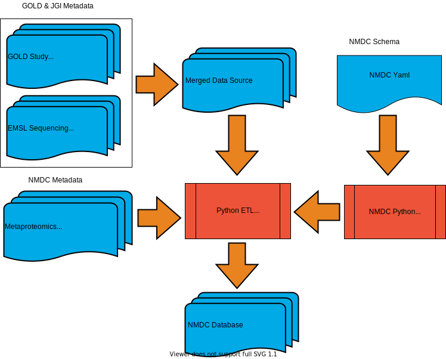

# Usage

```
# Run only when metadata sources change
# TODO: re-target to online metadata store rather than to local zipped tsv files
make build-merged-db

# Run when metadata translation logic changes
# TODO: re-target to online metadata store rather than to local zipped json file
make run-etl
```

# Details
The metadata translation process brings together metadata from a number of data sources:
- [GOLD](https://gold.jgi.doe.gov/) 
- [JGI](https://jgi.doe.gov/) 
- [EMSL](https://www.pnnl.gov/environmental-molecular-sciences-laboratory)
- NMDC metagenome and metaprotemoic metadata 

Details about these metadata sources are descibed in the [data directory](src/data).  

This metadata is translated into JSON conformant with the [NMDC schema](https://github.com/microbiomedata/nmdc-schema). The process is illustrated in the figure below.

- Metadata from [GOLD](https://gold.jgi.doe.gov/), [JGI](https://jgi.doe.gov/), and [EMSL](https://www.pnnl.gov/environmental-molecular-sciences-laboratory) is collected and merged into a single data source([nmdc_merged_data.tsv.zip](src/data/nmdc_merged_data.tsv.zip)) to facilate access.  
- The [NMDC schema](https://github.com/microbiomedata/nmdc-schema/blob/main/src/schema/nmdc.yaml) is defined in using `yaml` and transformed into a [python libary](https://github.com/microbiomedata/nmdc-schema/blob/main/python/nmdc.py) using the [Linked Data Nodeling Language](https://github.com/linkml/linkml).
- NMDC metagenome and metaproteomic metadata is collected and input into the [python ETL pipeline](src/bin/execute_etl_pipeline.py) along with the [GOLD](https://gold.jgi.doe.gov/), [JGI](https://jgi.doe.gov/), and [EMSL](https://www.pnnl.gov/environmental-molecular-sciences-laboratory) metadata.
- The [python ETL pipeline](src/bin/execute_etl_pipeline.py) uses the [NMDC Schema PyPI package](https://pypi.org/project/nmdc-schema/) to build the final [NMDC JSON database](src/data/nmdc_database.json.zip).  


 
