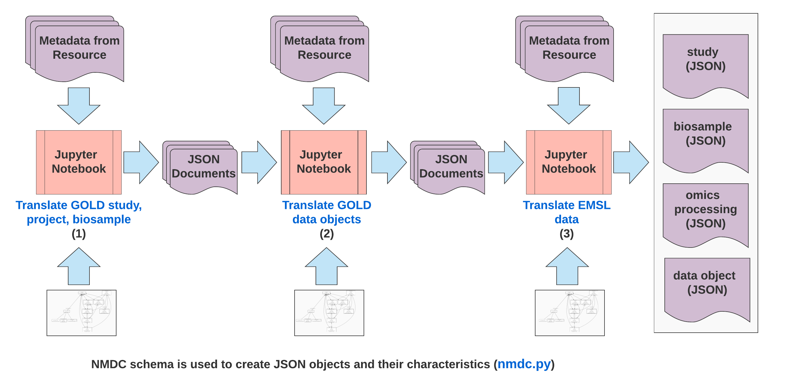
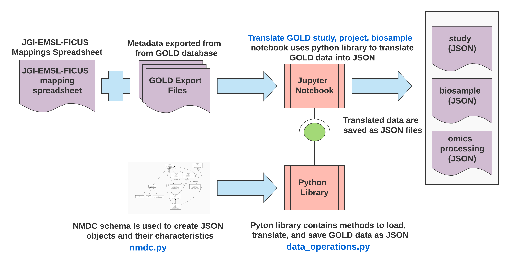

# Notebooks
We use [Jupyter notebooks](https://jupyter.org/) to integrate the metadata sources. This allows us to iterate quickly in a transparent and interactive manner as new metadata sources become available. 

## Notebook setup
We use [venv](https://docs.python.org/3/tutorial/venv.html) to create a virtual enironment.  

To create a virtual environment run the command `python3 -m venv <environment name>`  .  
I typically name my environment `.env`, and configure `.gitignore` to ignore `.env` files. This prevents the environment libraries from being uploaded to the repository.  

After the environment is created, run the command `source <environment name>/bin/activate` to enter the environment.  
Once in the environment, run the command `pip install -r requirements.txt` to install the necessary python libraries.

You exit the environment by executing the command `deactivate` in the terminal.

## Translation workflow

The [translation pipeline](https://github.com/microbiomedata/nmdc-metadata/blob/master/metadata-translation/notebooks/translation-pipeline.ipynb) notebook translates metadata to JSON. Operationally, it executes the following notebooks in order:
1. [Translate GOLD study, project, biosample](https://github.com/microbiomedata/nmdc-metadata/blob/master/metadata-translation/notebooks/translate-GOLD-study-project-biosample.ipynb)
2. [Translate GOLD data objects](https://github.com/microbiomedata/nmdc-metadata/blob/master/metadata-translation/notebooks/translate-GOLD-data-objects.ipynb)
3. [Translate EMSL data](https://github.com/microbiomedata/nmdc-metadata/blob/master/metadata-translation/notebooks/translate-EMSL-data.ipynb)

The final output is saved to the directory `./output/nmdc-json/`.

A high-level overview of the translation process is depicted below. At each step, metadata and the [NMDC schema](lib/nmdc.py) are input into the translation notebook, and JSON files are created. The output of the last step is forwarded to the web-development team for ingestion and display on the [NMDC pilot site](https://microbiomedata.github.io/pilot/).  

## Translate GOLD study, project, biosample 
Metadata from [GOLD](https://gold.jgi.doe.gov/) and mapping information are input into the translation process notebook. The output of this initial step consists of a set JSON files with metadata about NMDC studies, omics processings, and biosamples.  

The metadata files for this step are contained in:
* [nmdc-version2.zip](https://drive.google.com/drive/u/1/folders/1Wohthyv23Wi6VjY2i_N3AkZuuKPL_P_Q): contains [GOLD's](https://gold.jgi.doe.gov/) metadata.
* [JGI-EMSL-FICUS-proposals.fnl.xlsx](https://drive.google.com/drive/u/1/folders/1frzGlz8EB8inpVokNTSwD6Ia94eVUlsZ) contains mappings between [GOLD's](https://gold.jgi.doe.gov/) studies and [EMSL](https://www.pnnl.gov/environmental-molecular-sciences-laboratory) proposals.

 

## Translate GOLD data objects
Metadata from [JAMO's](https://storageconference.us/2018/Presentations/Beecroft.pdf) are input into the translation notebook. Omics processing metadata is updated to include links between omics processing and the outputs (i.e., data objects) of omics processings.

The metadata files for this step are contained in:
* [ficus_project_fastq.tsv](https://drive.google.com/drive/u/1/folders/1frzGlz8EB8inpVokNTSwD6Ia94eVUlsZ) (sequencing metadata)
* [ficus_project_fna.tsv](https://drive.google.com/drive/u/1/folders/1frzGlz8EB8inpVokNTSwD6Ia94eVUlsZ) (nucleotide assembly metadata)
* [ficus_project_faa.tsv](https://drive.google.com/drive/u/1/folders/1frzGlz8EB8inpVokNTSwD6Ia94eVUlsZ) (amino acid assembly metadata)  
  

## Translate EMSL data
Metadata from [EMSL](https://www.pnnl.gov/environmental-molecular-sciences-laboratory) are input into the translation notebook. Omics processing and data object metadata are updated to include links between omics processing and studies and the outputs i.e., data objects) of omics processings. The final output of this steps is a stet of JSON files are ingested by the [NMDC pilot site](https://microbiomedata.github.io/pilot/).

The metadata files for this step are contained in:
* [EMSL_FICUS_project_process_data_export.xlsx](https://drive.google.com/drive/u/1/folders/1frzGlz8EB8inpVokNTSwD6Ia94eVUlsZ): contains [EMSL](https://www.pnnl.gov/environmental-molecular-sciences-laboratory) experiment metadata.
* [FICUS - JGI-EMSL Proposal - Gold Study - ID mapping and PI.xlsx](https://drive.google.com/drive/u/1/folders/1frzGlz8EB8inpVokNTSwD6Ia94eVUlsZ): contains mappings between [EMSL](https://www.pnnl.gov/environmental-molecular-sciences-laboratory) experiment metadata and [GOLD](https://gold.jgi.doe.gov/) studies.

## Future work
Develop a more automated ETL pipeline. This may (or may not) include making use of [Papermill](https://papermill.readthedocs.io/en/latest/) to execute batch runs of notebooks.
